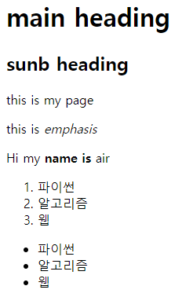
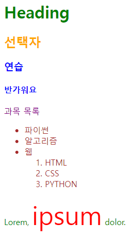

# Fundametals of HTML and CSS

### World Wide Web
- 인터넷으로 연결된 컴퓨터들이 정보를 공유하는 거대한 정보 공간

### Web site
- 인터넷에서 여러 개의 Web page가 모인 것으로, 사용자들에게 정보나 서비스를 제공하는 공간

### Web page
- HTML, CSS 등의 웹 기술을 이용하여 만들어진, "Web site"를 구성하는 하나의 요소

### Web page 구성 요소
- 집을 짓는 다고 비유

- House : Structure(철골) / Styling(페인트) / Behavior (전기)

- Web page : HTML (Structure) / CSS (Styling) / Javascript (Behavior)

## 웹 구조화

## HTML
- Hyper Text Markup Language 
  
- 웹 페이지의 의미와 '구조'를 정의하는 언어
  
### Hypertext
- 웹 페이지를 다른 페이지로 연결하는 링크 참조를 통해 사용자가 한 문서에서 다른 문서로 즉시 접근할 수 있는 텍스트

### Markup Language
- 태그 등을 이용하여 문서나 데이터의 구조를 명시하는 언어 ex) HTML, Markdown
  
### Markup Language 예시
```HTML
<h1> HTML </h1> 
<p> ~~~ </p>
<h2> Hyper Text</h2>

의미가 없는 텍스트에 의미를 부여 하는 일
```

## Structure of HTML

### HTML 구조
```HTML
<!DOCTYPE html>
- 해당 문서가 html 문서라는 것을 나타냄

<html></html>
- 전체 페이지의 콘텐츠를 포함

<title></title>
- 브라우저 탭 및 즐겨찾기 시 표시되는 제목으로 사용
```
- <> 태그 : 열린 태그 / </> 태그 : 닫힌 태그

```HTML
<!DOCTYPE html>
<html lang = "en"> 사용하는 언어를 설정
<head>
  <meta charset = "UTF-8"> 
  닫는 태그가 없음 / 닫는 태그가 없는 경우 그 자체로 그 기능을 수행
  <title>My page</title>
  Naver 와 같이 브라우저 탭 및 즐겨찾기 시 표시되는 제목
</head>
<body>
  <p>This is my page</p>
</body>
하나의 html 은 머리와 몸통으로 이루어져 있다  
</html>

alt + b -> 우리가 만든 브라우저를 랜더링해서 보여주는 단축키
```


### <head></head>
- HTML 문서에 관련된 설명, 설정 등
- 사용자에게 보이지 않음

### <body></body>
- 페이지에 표시되는 모든 태그

### HTML Elemet(요소)
```HTML
opening tag             closing tag
<p>My cat is very grumpy</p>
   -      content     -
-         element         -
```

- 하나의 요소는 여는 태그와 닫는 태그 그리고 그 안의 내용으로 구성됨
- 닫는 태그는 태그 이름 앞에 슬래시가 포함되며 닫는 태그가 없는 태그도 존재

### HTML Attributes(속성)
```HTML
           Attribute
<p class = "editor-note">My cat is very grump</p>
```
#### 규칙
- 속성은 요소 이름과 속성 사이에 공백이 있어야 함
- 하나 이상의 속성들이 있는 경우엔 속성 사이에 공백으로 구분함
- 속성 값은 열고 닫는 따옴표로 감싸야함

#### 목적
- 나타내고 싶지 않지만 '추가적인 기능, 내용'을 담고 싶을 때 사용
- CSS에서 해당 '요소를 선택' 하기 위한 값으로 활용됨

```html
<!DOCTYPE html>
<html lang = "en">
<head>
  <meta charset = "UTF-8">
  <title>My page</title>
</head>
<body>
  <p>This is my page</p>
  <a href="https://www.google.co.kr/">Google</a> 
  a 태그는 하이퍼 텍스트를 만드는 태그
  
       source의 약자
  이미지 경로는 로컬 주소 / 온라인 주소 상관 없음
  
  alt 는 스크린 리더가 읽는 부분
  예를 들어 시각장애인 분들이 스크린 리더를 통해서 웹을 확인 할 때 alt를 통해 들음
</body>
</html>
```


## Text Structure
### HTML Text structure
- HTML의 주요 목적 중 하나는 '텍스트 구조와 의미'를 제공하는 것

### HTML
- HyperText Markup Language
- 웹 페이지의 '의미'와 구조를 정의하는 언어
```html
<h1>Heading</h1>
예를 들어 h1 요소는 단순히 텍스트를 크게만 만드는 것이 아닌
현재 '문서의 최상위 제목'이라는 의미를 부여하는 것
```

```html
<!DOCTYPE html>
<html lang = 'en'>
<head>
    <meta charset="UTF-8">
    <meta name ="viewport" content="widthe=device-width, initial-scale=1.0">
    <title>Document</title>
</head>
<body>
  <h1>main heading</h1>
  <h2>sunb heading</h2>
  <p>this is my page</p>
  <p>this is <em>emphasis</em></p> 기울임 태그
  <p>Hi my <strong>name is</strong> air</p> 볼드 태그
  <ol>
    <li>파이썬</li>
    <li>알고리즘</li>
    <li>웹</li>
  </ol>
  ordered list 정렬된 리스트
  <ul>
    <li>파이썬</li>
    <li>알고리즘</li>
    <li>웹</li>
  </ul>
  정렬되지 않는 리스트
</body>  
</html>

태그의 들여쓰기는 html 문법에 영향을 주지 않음
but 구조 파악을 위해서 들여쓰기를 함
보통 들여쓰기는 2칸으로 권장을 함
프로그래밍 언어가 아니기 때문에 문법적으로 잘못됐으면 그냥 출력을 안해버리거나 이상하게 해버림
디버깅을 위해 항상 개발자도구를 켜고 확인해야함
```


## CSS
- Cascading Style Sheet
- 웹페이지의 '디자인'과 '레이아웃'을 구성하는 언어

### CSS 구문
- 선택자(Selector) : 무엇을 먼저 디자인 할 것 인가
- 선언(Declaration)
- 속성(Property)
- 값(Value)

```css
선택자(Selector)
h1 {
  color: red; 세미콜론으로 문장 끝남 명시
  font=size : 30px;
  속성(Property) 값(Value)
} 
```

### CSS 적용 방법
1. 인라인(Inline) 스타일
   - HTML 요소 안에 style 속성 값으로 작성
  
2. 내부(Internal) 스타일 시트
   - head 태그 안에 style 태그에 작성

3. 외부(External) 스타일 시트
   - 별도의 CSS 파일 생성 후 HTML link 태그를 사용해 불러오기

### CSS Selectors
- HTML 요소를 선택하여 스타일을 적용할 수 있도록 하는 선택자

### CSS Selctors 종류 및 특징
1. 전체 선택자 (*)
   - HTML 모든 요소를 선택

2. 요소 선택자
   - 지정한 모든 태그를 선택

3. 클래스 선택자('.' (dot))
   - 주어진 클래스 속성을 가진 모든 요소를 선택

4. 아이디 선택자 ('#')
   - 주어진 아이디 속성을 가진 요소 선택
   - 문서에는 주어진 아이디를 가진 요소가 하나만 있어야 함
   - 한번만 쓰일 것이라는 것을 선언

5. 자손 결합자 ("" (space))
   - 첫번째 요소의 자손 요소들 선택
   - 예) p span은 <p> 안에 있는 모든 <span>를 선택(하위 레벨 상관없이)
   - 선택한 요소의 모든 하위 요소들을 선택

6. 자식 결합자 (">")
   - 첫번째 요소의 직계 자식만 선택
   - 예) ul > li은 <ul> 안에 있는 모든 <li>를 선택 (한단계 아래 자식들만)

```html
<!DOCTYPE html>
<html lang="en">

<head>
  <meta charset="UTF-8">
  <meta http-equiv="X-UA-Compatible" content="IE=edge">
  <meta name="viewport" content="width=device-width, initial-scale=1.0">
  <title>Document</title>
  <style>
    * {
      color: red;
    }
     /* 모든 h2 요소의 텍스트 색을 주황색으로 변경*/
    모두 바뀌기 때문에 요소 선택자는 불편함이 있음
    h2 {
      color: orange;
    }

    h3, h4 {
      color: blue;
    }
    .green {
      color : green;
    }
    #purple {
      color: purple;
    }
    /* 자식결합자 */
    .green > span {
      font-size: 50px;
    }

    /* 자손 결합자 */
    .green li {
      color: brown;
    }
    
  </style>
폭포처럼 떨어진다
먼저 적용된 것 부터 적용
</head>

<body>
  <h1 class="green">Heading</h1>
  <h2>선택자</h2>
  <h3>연습</h3>
  <h4>반가워요</h4>
  <p id="purple">과목 목록</p>
  <ul class="green">
    <li>파이썬</li>
    <li>알고리즘</li>
    <li>웹
      <ol>
        <li>HTML</li>
        <li>CSS</li>
        <li>PYTHON</li>
      </ol>
    </li>
  </ul>
  <p class="green">Lorem, <span>ipsum</span> dolor.</p>
</body>
클래스 선택자의 장점 : 스타일을 재사용할 수 있다
클래스를 선언하고 .~~ class 에 적용
아이디 선택자는 하나만 사용하도록 작성 / 적용은 되지만 구조적으로 그렇게 사용 x
</html>

클래스로만 주로 사용하는 경우 : 재사용성 + 우선순위
```


### Specificity (우선 순위 혹은 명시도)
- 동일한 요소에 적용 가능한 같은 스타일을 두 가지 이상 작성했을 때 어떤 규칙이 적용 되는지 결정하는 것

### Cascade (계단식)
- 동일한 우선순위를 같는 규칙이 적용될 때 CSS에서 마지막에 나오는 규칙이 사용됨

### Cascade 예시
- h1 태그 내용의 색은 purple이 적용됨
  
```css
h1 {
  color: red;
}
h1 {
  color: purple;
}
```

### Specificity 예시
- 동일한 h1 태그에 다음과 같이 스타일이 작성된다면 h1 태그 내용의 색은 purple이 적용됨
```css
.make-red {
  color: red;
}
h1 {
  color: purple;
}
```

### 우선순위가 높은 순
1. Importance
   - !important

2. Inline 스타일
  
3. 선택자
   - id 선택자 (한 곳에서 쓰도록 의미가 적용) > class 선택자 > 요소 선택자

4. 소스 코드 순서

- (class 선택자만 사용할 경우 우선순위 상관없이 모듈적으로 어떤 스타일을 입힐지만 고려하면 된다 / 함수를 만든다고 생각하면 편함)


```html
<!DOCTYPE html>
<html lang="en">

<head>
  <meta charset="UTF-8">
  <meta http-equiv="X-UA-Compatible" content="IE=edge">
  <meta name="viewport" content="width=device-width, initial-scale=1.0">
  <title>Document</title>
  <style>
    h2 {
      color: darkviolet !important;
    }

    p {
      color: blue;
    }

    .orange {
      color: orange;
    }
    
    .green {
      color: green;
    }

    #red {
      color: red;
    }

  </style>
</head>

<body>
  <p>1</p>
  <p class="orange">2</p>
  <p class="green orange">3</p> 
  우선순위가 같지만 소스코드 순서에 의해 green
  순서는 중요하지 않다 그냥 클래스에 green orange를 입력한 것 뿐
  <p class="orange green">4</p>
  <p id="red" class="orange green">5</p>
  id가 우선순위가 높으니 red
  <h2 id="red">6</h2>
  !important 가 우선순위가 높으므로 red로 변경되지 않음
  <p>7</p>
  <h2>8</h2>
</body>

</html>
```


### !important
- 다른 우선순위 규칙보다 우선하여 적용하는 키워드
- "Cascade의 구조를 무시하고 강제로 스타일을 적용하는 방식이므로 사용을 권장하지 않음"


### 참고
#### HTML 관련 사항
- 요소(태그) 이름은 대소문자를 구분하지 않지만 "소문자" 사용을 권장
- 속성의 따옴표는 작은 따옴표와 큰 따옴표를 구분하지 않지만 "큰 따옴표" 권장
- HTML은 프로그래밍 언어와 달리 에러를 반환하지 않기 떄문에 작성 시 주의

#### CSS인라인(inline) 스타일은 사용하지 말 것
- CSS와 HTML 구조 정보가 혼합되어 작성되기 때문에 코드를 이해하기 어렵게 만듦

#### CSS의 모든 속성을 외우는 것이 아님
- 자주 사용되는 속성은 그리 많지 않으며 주로 활용 하는 속성 위주로 사용하다 보면 자연스럽게 익히게 됨
- 그 외 속성들은 개발하며 필요할 때마다 검색해서 학습 후 사용할 것

#### 속성은 되도록 'class'만 사용할 것
- id, 요소 선택자 등 여러 선택자들과 함께 사용할 경우 우선순위 규칙에 따라 예기치 못한 스타일 규칙이 적용되어 전반적인 유지보수가 어려워지기 때문
- 문서에서 단 한번 유일하게 적용될 스타일에 경우에만 id 선택자 사용을 고려

#### 웹 자료 검색 시
- how to render image in html 'mdn'
- 'mdn' 문서가 가장 공신력 있는 문서