# CSS Layout

## CSS Box Model
- 모든 HTML 요소를 사각형 박스로 표현하는 개념
- 원 모양이더라도 원이 아니라 네모 박스를 깎은 것 (사각형의 요소)

## 구성 요소

### CSS Box Model
- 모든 HTML 요소를 사각형 박스로 표현하는 개념
- 내용(content), 안쪽 여백(padding), 테두리(border), 외부 간격(margin)으로 구성되는 개념

### Box 구성 요소
- Content : 콘텐츠가 표시되는 영역
- Padding : 콘텐츠 주위에 위치하는 공백 영역
- Border : 콘텐츠와 패딩을 감싸는 테두리 영역
- Margin : 박스와 다른 요소 사이의 공백 가장 바깥쪽 영역


- 박스 구성요소는 개발자도구에서 바로 수정할 수 있다
- 개발자 도구에서 수치를 확인 후에 수치를 넣는 방법도 있다

### Box 구성의 방향 별 명칭
- 위 : top
- 오른쪽 : right
- 왼쪽 : left
- 아래 : bottom
- (ex. border-top, border-bottom, border-left, border-right...)
  
```html
<!DOCTYPE html>
<html lang="en">
<head>
  <meta charset="UTF-8">
  <meta name="viewport" content="width=device-width, initial-scale=1.0">
  <title>Document</title>
  <style>
    .box1 {
      width: 200px;
      padding-left: 25px; 컨텐츠를 오른쪽으로 옮기기 위한 패딩 옮기기
      padding-bottom: 25px;
      border-width: 3px;
      border-color: black; border의 색설정
      border-style: solid; border의 선을 실선으로
      margin-left: 25px;
      margin-bottom: 50px;
    }
    /* html은 좌측상단에서 항상 시작 => margin-right값이 기본적으로 존재한다 */
    .box2 {
      width: 200px;
      border: 3px black dashed; 한번에 작성 가능, 순서는 상관 없음 / 단축 속성
      /* margin-left: auto; 오른쪽 정렬
      margin-right: auto; 왼쪽과 오른쪽 값이 같아지기 때문에 중앙 정렬 */
      margin: 100px auto; 상하 100px 좌우 auto / 단축 속성
      padding: 25px 50px; 상하 25px 좌우 50px
    }
  </style>
</head>
<body>
  <div class="box1">box1</div>
  <div class="box2">box2</div>
</body>
</html>
```
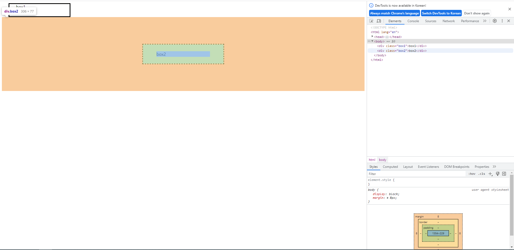

### width & height 속성
- 요소의 너비와 높이를 지정
- 이때 지정되는 요소의 너비와 높이는 콘텐츠 영역을 대상으로 함
- 예) 200px을 줬을 때 컨텐츠가 200px이므로 border는 200px보다 크게 나온다
  
```html
<!DOCTYPE html>
<html lang="en">
<head>
  <meta charset="UTF-8">
  <meta name="viewport" content="width=device-width, initial-scale=1.0">
  <title>Document</title>
  <style>
    /* * {
      box-sizing: border-box;
    }
    전체 박스 사이즈를 border-box 기준으로 잡고 가겠다 */

    .box {
      width: 100px; 실제 border의 값은 124
      border: 2px solid black;
      margin: 20px;
      background-color: yellow;
    }

    .content-box {
      box-sizing: content-box;
    }

    .border-box {
      box-sizing: border-box; css box size를 border-box로 하겠다
    }
  </style>
</head>
<body>
  <div class="box content-box">content-box</div>
  <div class="box border-box">border-box</div>
</body>
</html>
```
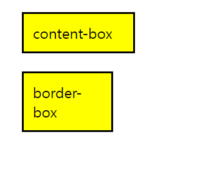
## 박스 타입
- Block & Inline (display : )

### Normal flow
- CSS를 적용하지 않았을 경우 웹페이지 요소가 기본적으로 배치되는 방향
- a 태그, img 태그 오른쪽으로 쌓임 (Inline Direction : 본인의 콘텐츠 크기 만큼만 차지)
- div태그, p태그 아래로 쌓임 (Block Direction : 블락은 오른쪽 영역을 다 차지함)

```html
<!DOCTYPE html>
<html lang="en">
<head>
  <meta charset="UTF-8">
  <meta name="viewport" content="width=device-width, initial-scale=1.0">
  <title>Document</title>
  <style>
    a,
    span,
    img {
      border: 3px solid red;
    }
    h1,
    p,
    div {
      border: 1px solid blue;
    }
  </style>
</head>
<body>
  <h1>Normal flow</h1>
  <p>Lorem, ipsum dolor sit amet consect explicabo</p>
  <div>
    <p>block 요소는 기본적으로 부모 요소의 너비 100%를 차지하며, 자식콘텐츠의 최대 높이를 취한다.</p>
    <p>block 요소의 총 너비와 총 높이는 content + padding +vorder width/height 다</p>
  </div>
  <p>block 요소는 서로 margin로 구분된다</p>
  <p>inline요소는 <span>이 것처럼</span> 자체 콘텐츠의 너비와 높이만 차지한다. 
    그리고 inline 요소는 <a href="#">width나 height 속성을 지정할 수 없다.</a></p>
  <p>
    물론 이미지도 인라인 요소다. 
    단, 이미지는 다른 inline 요소와 달리 width나 height로 크기를 조정할 수 있다.
  </p>
  <p>
    만약 inline 요소의 크기를 제어하려면 block요소로 변경하거나 inline-block 요소로 설정해주어야 한다.
  </p>

</body>
</html>
```
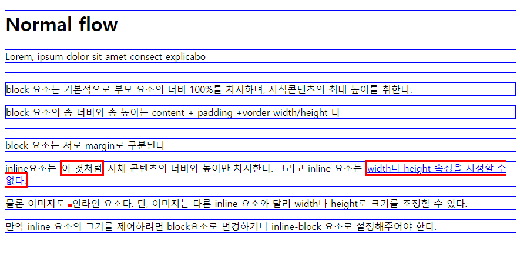

### block 타입 특징
1. 항상 새로운 행으로 나뉨
2. width와 height 속성을 사용하여 너비와 높이를 지정할 수 있음
3. 기본적으로 width 속성을 지정하지 않으면 박스는 inline 방향으로 사용 가능한 공간을 모두 차지함 (너비를 사용가능한 공간의 100%로 채우는 것)
4. 대표적인 block 타입 태그
   - h1~6, p, div

## inline 타입 특징
1. 새로운 행으로 나뉘지 않음
2. width와 height 속성을 사용할 수 없음
3. 수직 방향
   - padding, margins, borders가 적용되지만 다른 요소를 밀어낼 수는 없음
4. 수평 방향
   - padding, margins, bordrs가 적용되어 다른 요소를 밀어낼 수  있음
5. 대표적인 inline 타입 태그
   - a, img, span

### 속성에 따른 수평 정렬
- block 요소들은 수평을 margin 을 통해서 수평 정렬
- inline 요소들은 text-align을 통해서 수평 정렬

## 기타 display 속성

### inline-block
- inline과 block 요소 사이의 중간 지점을 제공하는 display 값
- block 요소의 특징을 가짐
    - width 및 height 속성 사용가능
    - padding, margin 및 border로 인해 다른 요소가 밀려남
- 요소가 줄 바꿈 되는 것을 원하지 않으면서 (inline) 너비와 높이를 적용하고 싶은 경우에 사용 (block)

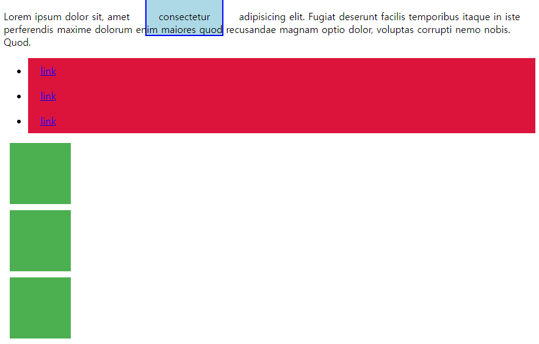
- inline-block 주기 전
```html
<!DOCTYPE html>
<html lang="en">
<head>
  <meta charset="UTF-8">
  <meta name="viewport" content="width=device-width, initial-scale=1.0">
  <title>Document</title>
  <style>
    span {
      margin: 20px;
      padding: 20px;
      width: 80px;
      height: 50px;
      background-color: lightblue;
      border: 2px solid blue;
      display: inline-block;
    }
    
    ul>li {
      background-color: crimson;
      padding: 10px 20px;
      display: inline-block;
    }

    .container {
      text-align: center; 가운데 정렬을 margin으로만 할 수 있는게 아니다
    }
    
    .box {
      display: inline-block;
      width: 100px;
      height: 100px;
      background-color: #4CAF50;
      margin: 10px;
    }
  </style>
</head>
<body>
  <!-- 1. 이제 다른 요소를 밀어낼 수 있는 span -->
  <p>Lorem ipsum dolor sit, amet <span>consectetur</span> adipisicing elit. 
    Fugiat deserunt facilis temporibus itaque in iste perferendis maxime dolorum enim maiores quod recusandae magnam optio dolor, 
    voluptas corrupti nemo nobis. Quod.</p>

  <!-- 2. 리스트 요소를 가로로 정렬 -->
  <ul>
    <li><a href="#">link</a></li>
    <li><a href="#">link</a></li>
    <li><a href="#">link</a></li>
  </ul>
  <!-- 보통 네비게이션 바에서 응용할 수 있음 -->

  <!-- 3. div 요소를 가로로 정렬 -->
  <div class="container">
    <div class="box"></div>
    <div class="box"></div>
    <div class="box"></div>
  </div>
</body>
</html>
```
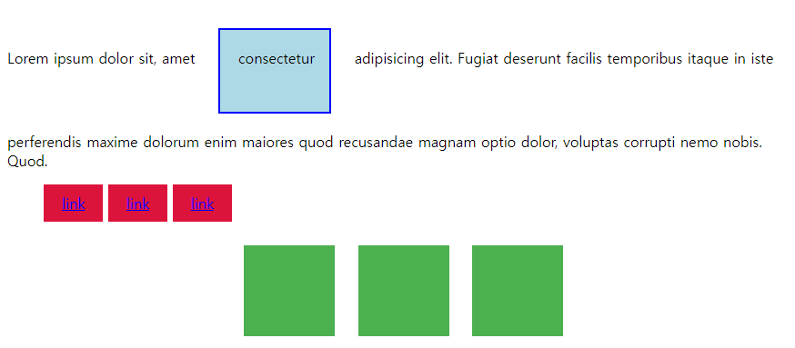

### none
- 요소를 화면에 표시하지 않고, 공간조차 부여되지 않음
  
```html
<!DOCTYPE html>
<html lang="en">
<head>
  <meta charset="UTF-8">
  <meta name="viewport" content="width=device-width, initial-scale=1.0">
  <title>Document</title>
  <style>
    .box {
      width: 100px;
      height: 100px;
      background-color: red;
      border: 2px solid black;
    }
    .none {
      display: none;
    }
  </style>
</head>
<body>
  <div class="box">1</div>
  <div class="box none">2</div>
  <div class="box">3</div>
</body>
</html>
```
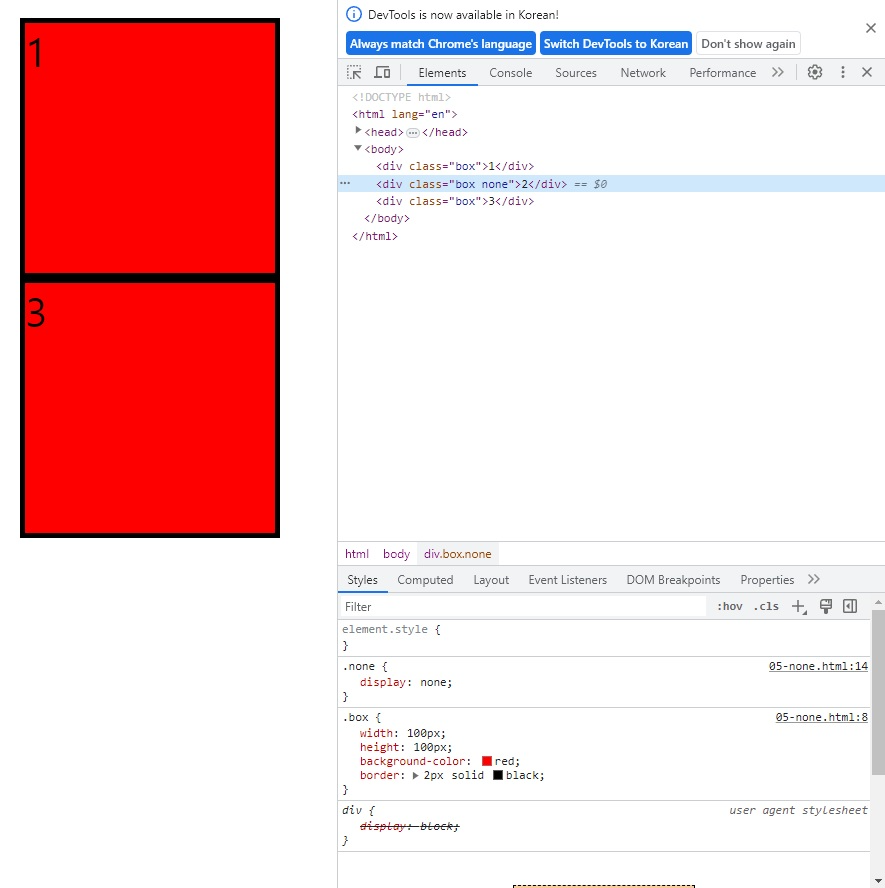
- 참고 : none 부여 후 나중에 js를 통해서 처리할 수 있음

## CSS Layout Position

### CSS Layout
- 각 요소의 위치와 크기를 조정하여 웹 페이지의 디자인을 결정하는 것
- Display, Position, Float, Flexbox 등

### CSS Position
- 요소를 Normal Flow에서 제거하여 다른 위치로 배치하는 것
- -> 다른 요소 위에 올리기, 화면의 특정 위치에 고정시키기 등

### Position 이동 방향
- top, left, right, bottom / Z Axis (어떠한 요소 위에 올려 놓을 수 있음)

### Position 유형
1. static
2. relative
3. absolute
4. fixed
5. sticky

```html
<!DOCTYPE html>
<html lang="en">
<head>
  <meta charset="UTF-8">
  <meta name="viewport" content="width=device-width, initial-scale=1.0">
  <title>Document</title>
  <style>
    * {
      box-sizing: border-box;
    }

    body {
      height: 1500px;
    }

    .container {
      /* position: relative; */
      height: 300px;
      width: 300px;
      border: 1px solid black;
    }

    .box {
      height: 100px;
      width: 100px;
      border: 1px solid black;
    }

    .static {
      position: static;
      background-color: lightcoral;
    }

    .absolute {
      position : absolute;
      절대적 위치 (집나간 자식, 말을 안들음)
      자기가 차지한 위치를 버림
      위에 자리가 비어 있기 때문에 다른 레이아웃들이 차오름
      background-color: lightgreen;
      top: 100px;
      left: 100px;
      기준 static이 아닌 부모를 찾아 올라감
      계속 static 일 경우 body 까지 올라감
      보통 고정되어 있는 이미지 등에 사용함
    }

    .relative {
      position: relative; 
      상대적 위치 (기준이 상대에게 있다)
      background-color: lightblue;
      top: 100px;
      left: 100px;
      본인의 static 시절의 기준으로 top 100 left 100 만큼 이동
    }

    .fixed {
      position: fixed;
      고정 위치 (집나간 친구)
      집을 나가서 브라우저에 붙음
      background-color: grey;
      top: 0;
      right: 0;
    }
  </style>
</head>
<body>
  <div class="container">
    <div class="box static">Static</div>
    <div class="box absolute">Absolute</div>
    <div class="box relative">Relative</div>
    <div class="box fixed">Fixed</div>
  </div>
</body>
</html>
```
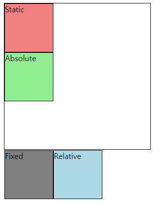
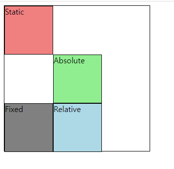
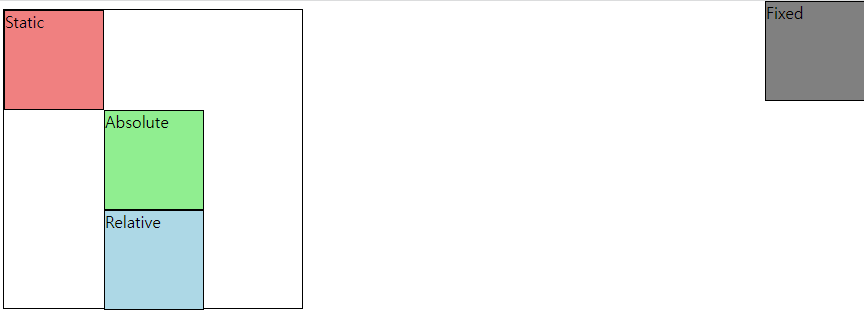

### Sticky

```html
<!DOCTYPE html>
<html lang="en">
<head>
  <meta charset="UTF-8">
  <meta name="viewport" content="width=device-width, initial-scale=1.0">
  <title>Document</title>
  <style>
    body {
      height: 1500px;
    }

    .sticky {
      position: sticky;
      top: 0;
      background-color: lightblue;
      padding: 20px;
      border: 20x solid black;
    }
  </style>
</head>
<body>
  <h1>Sticky positioning</h1>
  <div class="sticky">첫 번째 Sticky</div>
  <div>
    <p>내용1</p>
    <p>내용2</p>
    <p>내용3</p>
  </div>
  <div class="sticky">두 번째 Sticky</div>
  <div>
    <p>내용4</p>
    <p>내용5</p>
    <p>내용6</p>
  </div>
  <div class="sticky">세 번째 Sticky</div>
  <div>
    <p>내용7</p>
    <p>내용8</p>
    <p>내용9</p>
  </div>
</body>
</html>
```
- 다음 스티키 요소(임계점)가 나올 때까지 fixed
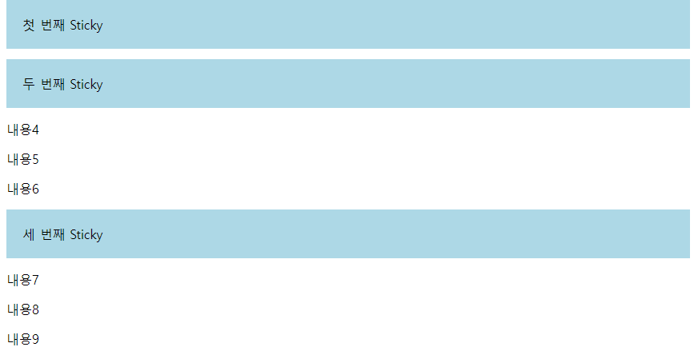
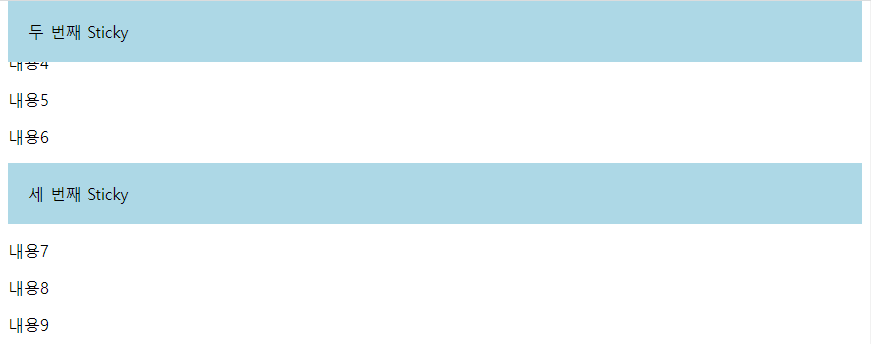

### Position 유형별 특징
1. static
   - 기본값
   - 요소를 Normal Flow에 따라 배치
2. relative
   - 요소르 Normal Flow에 따라 배치
   - 자기 자신을 기준으로 이동
   - 요소가 차지하는 공간은 static일 때와 같음
3. absolute
   - 요소를 Normal Flow에서 제거
   - 가장 가까운 relative 부모 요소를 기준으로 이동
   - 문서에서 요소가 차지하는 공간이 없어짐
4. fixed
   - 요소를 Normal Flow에서 제거
   - 현재 화면영역(viewport)을 기준으로 이동
   - 문서에서 요소가 차지하는 공간이 없어짐
5. sticky
   - 요소를 Normal Flow에 따라 배치
   - 요소가 일반적인 문서 흐름에 따라 배치되다가 스크롤이 특정 임계점에 도달하면 그 위치에 고정됨(fixed)
   - 만약 다음 sticky 요소가 나오면 다음 sticky 요소가 이전 sticky 요소의 자리를 대체
     - 이전 sticky 요소가 고정되어 있던 위치와 다음 sticky 요소가 고정되어야 할 위치가 겹치게 되기 때문


### absolute 예시
```html
<!DOCTYPE html>
<html lang="en">
<head>
  <meta charset="UTF-8">
  <meta name="viewport" content="width=device-width, initial-scale=1.0">
  <title>Document</title>
  <style>
    .card {
      width: 300px;
      height: 200px;
      border: 1px solid black; 
      position: relative;
      top: 100px;
    }

    .card-content {
      padding: 10px;
    }

    .badge {
      background-color: red;
      color: white;
      padding: 5px 10px;
      position: absolute;
      top: 0;
      right: 0;
    }
  </style>
</head>
<body>
  <div class="card">
    <div class="card-content">
      <h3>Card Title</h3>
      <p>Lorem ipsum, dolor sit amet consectetur adipisicing elit.</p>
      <span class="badge">New</span>
    </div>
  </div>
</body>
</html>
```


## z-index
- 요소가 겹쳤을 때 어떤 요소 순으로 위에 나타낼지 결정

### z-index 특징
- 정수 값을 사용해 Z축 순서를 지정
- 더 큰 값을 가진 요소가 작은 값의 요소를 덮음
  (예. PPT 사진 겹치기)

```html
<!DOCTYPE html>
<html lang="en">
<head>
  <meta charset="UTF-8">
  <meta name="viewport" content="width=device-width, initial-scale=1.0">
  <title>Document</title>
  <style>
    .container {
      position: relative;
    }

    .box {
      position: absolute;
      width: 100px;
      height: 100px;
    }

    .red {
      background-color: red;
      top: 50px;
      left: 50px;
      z-index: 3;
    }

    .green{
      background-color: green;
      top: 100px;
      left: 100px;
      z-index: 2;
    }

    .blue {
      background-color: blue;
      top: 150px;
      left: 150px;
      z-index: 1;
    }


  </style>
</head>
<body>
  <div class="container">
    <div class="box red"></div>
    <div class="box green"></div>
    <div class="box blue"></div>
  </div>
  
</body>
</html>
```


### CSS Layout Flexbox
- 요소를 행과 열 형태로 배치하는 1차원(선을 기준으로) 레이아웃 방식
- -> '공간 배열' & '정렬'

### 요소를 행과 열 형태로 배치하는 1차원 레이아웃 방식
- 왼쪽에서 오른쪽 / 오른쪽에서 왼쪽 / 위쪽에서 아래 / 아래에서 위

### Flexbox 기본사항
- Flex Container : Flexbox의 부모 (Flexbox가 움직이는 기준)
- Flex item : 움직이는 자식 요소
- main axis : 메인축 (수평축)
- corss axis : 교차축 (수직축)
- main start : 왼쪽부터 시작
- cross start : 위쪽부터 시작
- main 축은 축이 바뀔 수도 있고 시작이 바뀔 수도 있다 / 요소가 쌓이는 방향도 바꿀 수있다 -> 축이 바뀔 수도 있다

#### main axis(주 축)
- flex item 들이 배치되는 기본 축
- main start에서 시작하여 main end 방향으로 배치
- 항상 주 축만 기억하면 교차축은 자연스럽게 따라온다

#### cross axis(교차 축)
- main axis에 수직인 축
- cross start에서 시작하여 cross end 방향으로 배치

#### Flex Container
- display : flex; 혹은 display: inline-flex;가 설정된 부모 요소
- 이 컨테이너의 1차 자식 요소들이 Flex item이 됨
- flexbox 속성 값들을 사용하여 자식 요소 Flex item들을 배치
- Flex item 안에 flex item이 배치될 수 있다 중첩 요소 가능
- 자신의 한단계 아래 요소들에 대해서만 flex container 역할을 함

#### Flex item
- Flex Container 내부에 레이아웃 되는 항묵

## 레이아웃 구성
```html
<!DOCTYPE html>
<html lang="en">
<head>
  <meta charset="UTF-8">
  <meta name="viewport" content="width=device-width, initial-scale=1.0">
  <title>Document</title>
  <style>
    .container {
      height: 500px;
      border: 1px solid black;
      display: flex;
      /* flex-direction: row; 기본값 */
      /* flex-direction: column; 세로값 */
      /* flex-direction: row-reverse; */
      /* flex-wrap: wrap; */

      /* 메인 축 정렬 */
      justify-content: flex-start;
      justify-content: center;
      justify-content: flex-end;

      /* 여러 행 교차 축 정렬 wrap을 해줘야 움직임*/
      align-content: flex-start; 위쪽
      align-content: center; 가운데 정렬 (justify-content: center; 와 함께 쓰면 수직축 수평축 한가운데로 오게 됨)
      align-content: flex-end;

      /* 행 하나를 교차축 정렬 */
      align-items: flex-start;
      align-items: center;
      align-items: flex-end;
    }

    .post {
      background-color: grey;
      border: 1px solid black;
      margin: 0.5rem;
      padding: 0,5rem;
    }


    .item1{
      align-self: center;
    }

    .item2{
      align-self: flex-end;
    }
  </style>
</head>
<body>
  <div class="container"> 가장 부모
    <div class="post item1"> flex item
      <h2>Post Title 1</h2>
      <p>Post Content 1</p>
    </div>
    <div class="post itme2"> flex item
      <h2>Post Title 2</h2>
      <p>Post Content 2</p>
    </div>
    <div class="post"> flex item
      <h2>Post Title 3</h2>
      <p>Post Content 3</p>
    </div>
    <div class="post"> flex item
      <h2>Post Title 4</h2>
      <p>Post Content 4</p>
    </div>
  </div>
</body>
</html>
```
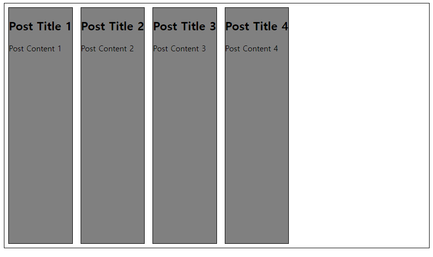
- 남는 영역은 부모의 높이 만큼 자연스레 채움
- 주 축이 좌에서 우로 가기 때문에 1~4 가 좌에서 우로

- main 축을 column으로

- flex-direction: row_reverse;
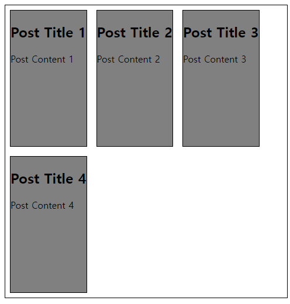
- flex-wrap: wrap; 기본값: nowrap;

#### flex-direction 지정
- flex item이 나열되는 방향을 지정
- column으로 지정할 경우 주 축이 변경됨
- -reverse로 지정하면 시작 선과 끝 선이 서로 바뀜

#### flex-wrap
- flex item 목록이 flex container의 하나의 행에 들어가지 않을 경우 다른 행에 배치할지 여부 설정
- 기본값은 nowrap

#### justify-content
- 주 축을 따라 flex item과 주위에 공간을 분배

#### align-content(여러 행)
- 교차 축을 따라 flex item과 주위에 공간을 분배
  - flex-wrap이 wrap 또는 wrap-reverse로 설정된 여러 행에만 적용됨
  - 한 줄 짜리 행에는 (flex-wrap이 nowrap으로 설정된 경우) 효과 없음

#### align-items
- 교차 축을 따라 flex item 행을 정렬

#### align-self
- 요소 하나를 정렬

### 목적에 따른 분류
- 배치 : flex-direction / flex-wrap
- 공간 분배 : justify-content / align-content
- 정렬 : align items / align self

### 속성명 Tip
- justify 주 축
- align 교차 축