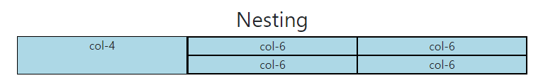
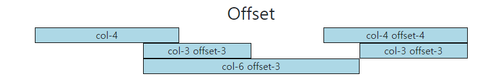
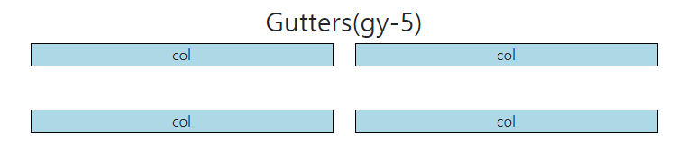
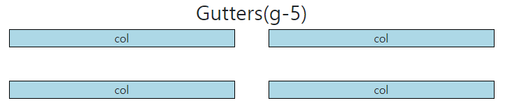
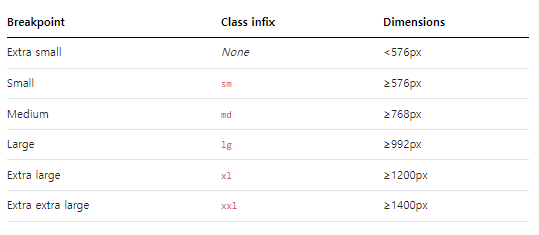

# Bootstrap Grid system

## Bootstrap Grid system
- 웹 페이지의 레이아웃을 조정하는 데 사용되는 '12개의 컬럼'으로 구성된 시스템
  (12는 약수가 많다 -> 레이아웃을 배치할 수 있는 경우의 수가 많다)

### Grid system 목적
- 반응형 디자인을 지원해 웹 페이지를 모바일, 태블릿, 데스크탑 등 다양한 기기에서 적절하게 표시할 수 있도록 도움
  (데스크탑 기준으로만 만들면 모바일, 태블릿 등에서 불편함을 겪을 수 있다)


### Grid system 기본요소
1. Container: Column들을 담고 있는 공간
2. Column: 실제 컨텐츠를 포함하는 부분
3. Gutter: 컬럼과 컬럼 사이의 여백 영역

- 1개의 row안에 12칸의 column 영역이 구성
- 각 요소는 12칸 중 몇 개를 차지할 것인지 지정됨 (화면 크기 별)

```html
<!DOCTYPE html>
<html lang="en">

<head>
  <meta charset="UTF-8">
  <meta http-equiv="X-UA-Compatible" content="IE=edge">
  <meta name="viewport" content="width=device-width, initial-scale=1.0">
  <link href="https://cdn.jsdelivr.net/npm/bootstrap@5.3.0-alpha1/dist/css/bootstrap.min.css" rel="stylesheet"
    integrity="sha384-GLhlTQ8iRABdZLl6O3oVMWSktQOp6b7In1Zl3/Jr59b6EGGoI1aFkw7cmDA6j6gD" crossorigin="anonymous">
  <style>
    .box {
      border: 1px solid black;
      background-color: lightblue;
      text-align: center;
    }
  </style>
</head>

<body>
  <h2 class="text-center">Basic</h2>
  <div class="container"> 
    가장 최상위 부모의 클래스는 container다 / 선언 시 좌우에 마진이 생겨 전체적인 틀을 잡아줌
    <div class="row">
      row 선언해서 가로로 정렬
      <div class="box col-4">col</div>
      <div class="box col-4">col</div>
      <div class="box col-4">col</div>
      픽셀기준이 아닌 12칸 기준으로 나눈 것이기 때문에 크기를 따라간다
    </div>
    <div class="">
      <div class="box col-4">col-4</div>
      <div class="box col-4">col-4</div>
      <div class="box col-4">col-4</div>
    </div>
    <div class="row">
      <div class="box col-2">col-2</div>
      <div class="box col-8">col-8</div>
      <div class="box col-2">col-2</div>
      총 합이 12칸이기 때문에 상관 없다
      예를 들어 2 8 4 일 경우 12칸이 넘어가서 4는 밑으로 내려간다
      큰 틀을 짠 후 콘텐츠 작성
    </div>
  </div>

  <hr>
  <!-- Nesting -->
  <h2 class="text-center">Nesting</h2>
  그리드 시스템 안에 또 다른 그리드 시스템이 '중첩'된 상태
  <div class="contianer">
    <div class="row">
      큰 row 입장에선 자식이 2개
      <div class="box col-4">col-4</div>
      <div class="box col-8">
        큰 틀로 4칸 8칸을 나눔
        <div class="row">
          중첩시킴
          <div class="box">col-6</div>
          <div class="box">col-6</div>
          <div class="box">col-6</div>
          <div class="box">col-6</div>
        </div>
      </div>
    </div>
  </div>

  <hr>
  <!-- Offset -->
  <h2 class="text-center">Offset</h2>
  상쇄
 <div class="container">
    <div class="row">
      <div class="box col-4">col-4</div>
      <div class="box col-4 offset-4">col-4 offset-4</div>
      4칸 점프하고 나와라
    </div>
    <div class="row">
      <div class="box col-3 offset-3">col-3 offset-3</div>
      <div class="box col-3 offset-3">col-3 offset-3</div>
    </div>
    <div class="row">
      <div class="box col-6 offset-3">col-6 offset-3</div>
    </div>
  </div>

  <hr>
  <!-- Gutters -->
  <h2 class="text-center">Gutters(gx-0)</h2>
  <div class="container">
    <div class="row gx-0">
      컬럼 간의 간격을 조정
      <div class="col-6">
        <div class="box">col</div>
        컬럼 작성 후 box 작성
      </div>
      <div class="col-6">
        <div class="box">col</div>
      </div>
    </div>
  </div>

  <br>

  <h2 class="text-center">Gutters(gy-5)</h2>
  <div class="">
    <div class="">
      <div class="">
        <div class="box">col</div>
      </div>
      <div class="">
        <div class="box">col</div>
      </div>
      <div class="">
        <div class="box">col</div>
      </div>
      <div class="">
        <div class="box">col</div>
      </div>
    </div>
  </div>


  <br>

  <h2 class="text-center">Gutters(g-5)</h2>
  <div class="">
    <div class="">
      <div class="">
        <div class="box">col</div>
      </div>
      <div class="">
        <div class="box">col</div>
      </div>
      <div class="">
        <div class="box">col</div>
      </div>
      <div class="">
        <div class="box">col</div>
      </div>
    </div>
  </div>

  <script src="https://cdn.jsdelivr.net/npm/bootstrap@5.3.0-alpha1/dist/js/bootstrap.bundle.min.js"
    integrity="sha384-w76AqPfDkMBDXo30jS1Sgez6pr3x5MlQ1ZAGC+nuZB+EYdgRZgiwxhTBTkF7CXvN"
    crossorigin="anonymous"></script>
</body>

</html>
```







### Gutters
- Grid system에서 column 사이에 여백 영역
- x축은 padding, y축은 margin으로 여백 생성

## Responsive Web Design
- 디바이스 종류나 화면 크기에 상관없이, 어디서든 일관된 레이아웃 및 사용자 경험을 제공하는 디자인 기술
- Bootstrap grid system에서는 12개의 column과 '6개의 breakpoints를 사용하여 반응형 웹 디자인을 구현 (너비가 바뀌는 지점)

## Grid system breakpoints
- 웹 페이지를 다양한 화면 크기에서 적절하게 배치하기 위한 분기점
- -> 화면 너비에 따라 6개의 분기점 제공(xs, sm, md lg, xl, xxl)


- 크기는 viewpoint 기준
- 각 breakpoints 마다 설정된 최대 너비 값 "이상으로" 화면이 커지면 grid system 동작이 변경됨
- ex) col-sm-4 col-md-8 sm 사이즈에선 4칸 / md 사이즈에선 8칸을 차지하겠다

```html
<!DOCTYPE html>
<html lang="en">

<head>
  <meta charset="UTF-8">
  <meta http-equiv="X-UA-Compatible" content="IE=edge">
  <meta name="viewport" content="width=device-width, initial-scale=1.0">
  <link href="https://cdn.jsdelivr.net/npm/bootstrap@5.3.0-alpha1/dist/css/bootstrap.min.css" rel="stylesheet"
    integrity="sha384-GLhlTQ8iRABdZLl6O3oVMWSktQOp6b7In1Zl3/Jr59b6EGGoI1aFkw7cmDA6j6gD" crossorigin="anonymous">
  <style>
    .box {
      border: 1px solid black;
      background-color: lightblue;
      text-align: center;
    }
  </style>
</head>

<body>
  <h2 class="text-center">Breakpoints</h2>
  <div class="container">
    <div class="row">
      <div class="box col-12 col-sm-6 col-md-2 col-lg-4">
        col
      </div>
      <div class="box col-12 col-sm-6 col-m-8 col-lg-4">
        col
      </div>
      <div class="box col-12 col-sm-6 col-md-2 col-lg-4">
        col
      </div>
      <div class="box col-12 col-sm-6 col-md-12 col-lg-12">
        col
      </div>
    </div>

    <hr>

    <h2 class="text-center">Breakpoints + offset</h2>
    <div class="row g-4">
      <div class="box col-12 col-sm-4">
        col
      </div>
      <div class="box col-12 col-sm-4">
        col
      </div>
      <div class="box col-12 col-sm-4">
        col
      </div>
      <div class="box col-12 col-sm-4 offset-sm-4">
        col
      </div>
    </div>
  </div>

    <!-- 주의 사항 -->
    <h2 h2 class="text-center">Breakpoints + offset</h2>
    <div class="row g-4">
      <div class="box col-12 col-sm-4 col-md-6">
        col
      </div>
      <div class="box col-12 col-sm-4 col-md-6">
        col
      </div>
      <div class="box col-12 col-sm-4 col-md-6">
        col
      </div>
      <div class="box col-12 col-sm-4 offset-sm-4 col-md-6 off-set-md-0">
        col
      </div>
    </div>
  </div>
  breakpoint는 ~이상 이기 때문에 다음 큰 사이즈이 브레이크 포인트가 나오지 않는 이상 멈추지 않는다

  <script src="https://cdn.jsdelivr.net/npm/bootstrap@5.3.0-alpha1/dist/js/bootstrap.bundle.min.js"
    integrity="sha384-w76AqPfDkMBDXo30jS1Sgez6pr3x5MlQ1ZAGC+nuZB+EYdgRZgiwxhTBTkF7CXvN"
    crossorigin="anonymous"></script>
</body>

</html>
```
### Media Qurery로 작성된 Grid System의 breakpoints
- Grid System은 화면 크기에 따라 12개의 칸을 각 요소에 나누어 주는 것