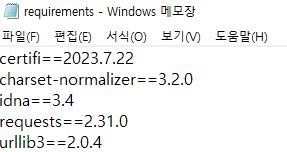
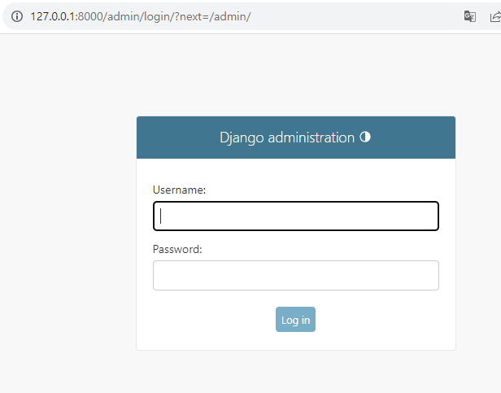
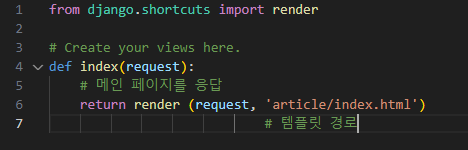

# Django Intro & Design Pattern

## Framework
### '웹 서비스 개발'에는 무엇이 필요할까?
- 로그인, 로그아웃, 회원관리, 데이터베이스, 보안 등.. 너무 많은 기술들이 필요
- 하지만 모든 걸 직접 만들 필요가 없음
- 잘 만들어진 것들을 가져와 좋은 환경에서 잘 사용하는 것도 능력인 시대
- "거인의 어깨 위에서 프로그래밍 하기"

### Framework
- 웹 애플리케이션을 빠르게 개발할 수 있도록 도와주는 도구
- (개발에 필요한 기본 구조, 규칙, 라이브러리 등을 제공)
- 누군가가 코드를 미리 다 짜놓은 것
- Frame + work

### 왜 프레임워크를 사용할까?
- 기본적인 구조, 도구, 규칙 등을 제공하기 때문에 개발자는 필수적인 해야 하는 핵심 개발에만 집중할 수 있음
- 여러 라이브러리를 제공해 개발 속도를 빠르게 할 수 있음 (생산성)
- 유지 보수와 확장에 용이해 소프트웨어의 품질을 높임

## django
- Python 기반의 대표적인 웹 프레임 워크

## 클라이언트와 서버

### 웹의 동작 방식
- 우리가 컴퓨터 혹은 모바일 기기로 웹 페이지를 보게 될 때까지 무슨일이 일어날까?
- Client ->request-> Server // Server ->responses-> Client
- '클라이언트-서버' 구조

### Client
- 서비스를 요청하는 주체 (웹 사용자의 인터넷이 연결된 장치, 웹 브라우저)

### Server
- 클라이언트의 요청에 응답하는 주체 (웹 페이지, 앱을 저장하는 컴퓨터)

### 우리가 웹 페이지를 보게 되는 과정
1. 웹 브라우저(클라이언트)에서 'google.com'을 입력
2. 브라우저는 인터넷에 연결된 전세계 어딘가에 있는 구글 컴퓨터(서버)에게 'Google 홈페이지.html' 파일을 달라고 요청
3. 요청을 받은 구글 컴퓨터는 데이터베이스에서 'Google 홈페이지.html' 파일을 찾아 응답
4. 전달받은 Google 홈페이지.html 파일을 웹 브라우저가 사람이 볼 수 있도록 해석해주면서 사용자는 구글의 메인 페이지를 보게 됨

## 프로젝트 및 가상환경

### 가상환경
- Python 애플리케이션과 그에 따른 패키지들을 격리하여 관리할 수 있는 '독립적인' 실행 환경

### 가상환경이 필요한 시나리오1
- 한 개발자가 2개의 프로젝트(A와 B)를 진행해야 한다.
- 프로젝트 A는 requests 패키지 버전 1을 사용해야 한다.
- 프로젝트 B는 requests 패키지 버전 2을 사용해야 한다.
- 하지만 파이썬 환경에서 패키지는 1개의 버전만 존재할 수 있다.
- A와 B 프로젝트 다른 패키지 버전 사용을 위한 '독립적인 개발 환경'이 필요하다.

### 가상환경이 필요한 시나리오2
- 한 개발자가 2개의 프로젝트(A와 B)를 진행해야 한다.
- 프로젝트 A는 water라는 패키지를 사용해야 한다.
- 프로젝트 B는 fire 라는 패키지를 사용해야 한다.
- 하지만 파이썬 환경에서 water 패키지와 fire 패키지를 함께 사용하면 충돌이 발생하기 때문에 설치할 수 없다.
- A와 B 프로젝트의 패키지 충돌을 막기 위해 각각 '독립적인 개발 환경'이 필요하다
- 또한 운영체제가 다르기 때문에 가상환경이 필요하다

### 가상환경 venv 생성
- $ pyton -m venv venv
-     (명령어) / (이름)
- 가상환경 생성 후 활성화 (active / on) 과정을 거쳐야 함
- venv는 파이썬 가상환경 이름으로서 관행적인 약속

### 가상환경 활성화
- $ source venv/Scripts/activate
    (Scripts 라는 곳에 activate 활성화 버튼이 있음)
- on / off 개념 가상환경을 켜고 끄는 개념
- 하나의 터미널 환경에선 하나의 환경만 켤 수 있다
- activate 될 때 (venv) 로 표시 됨
- $ deactivate 작성하면 비활성화 -> 글로벌 환경

### 환경에 설치된 패키지 목록 확인
- $ pip list
- 전역 환경에서 pip list

- 가상 환경에서 pip list

### 패키지 목록이 필요한 시나리오
- 만약 2명 (A와 B)의 개발자가 하나의 프로젝트를 함께 개발한다고 하자.
- 팀원 A가 먼저 가상환경을 생성 후 프로젝트를 설정하고 관련된 패키지를 설치하고 개발하다가 협업을 위해 github에 프로젝트를 push한다.
- 팀원 B는 해당 프로젝트를 clone 받고 실행해보려 하지만 실행되지 않는다.
- 팀원 A가 이 프로젝트를 위해 어떤 패키지를 설치했고, 어떤 버전을 설치 했는지 A의 가상환경 상황을 알 수 없다.

### 의존성 패키지
- 한 소프트웨어 패키지가 다른 패키지의 기능이나 코드를 사용하기 때문에 그 패키지가 존재해야만 제대로 작동하는 관계
- 사용하려는 패키지가 설치되지 않았거나, 호환되는 버전이 아니면 오류가 발생하거나 예상치 못한 동작을 보일 수 있음

### 의존성 패키지 예시
- requests 설치 후 설치되는 패키지 목록 변화(1개만 설치 되는 것이 아님)

### 의존성 패키지 목록 생성
- 가상환경에 대한 모습 즉 '패키지 목록'이 공유되어야 한다.
- (환경 자체를 직접 공유하지 않는다)
- 패키지가 설치된 목록을 작성한 텍스트 파일을 공유한다
- $ pip freeze
- $ pip freeze > requirements.txt
- (왼쪽에 있는 문구를 > 어떠한 형식으로 만들겠다.)

- 받은 문서를 한번에 설치할 수 있는 명령어 존재
- $ pip install -r requirements.txt

### Django 프로젝트 생성 전 루틴
1. 가상환경 생성
2. 가상환경 활성화
3. Django 설치
4. 의존성 파일 생성 (패키지 설치마다 진행)

### Django 프로젝트 생성
- $ django-admin startproject firstpjt .
- (장고 프로젝트를 생성 하겠다) / (프로젝트 명) /. (현재 디렉토리 전체)
  
### Django 서버 실행
- $ python manage.py runserver
- (manage.py와 동일한 경로에서 명령어 진행)
- ctrl + C 서버 종료

### Django 프로젝트 생성 루틴 정리 + git
1. 가상환경 생성
2. 가상환경 활성화
3. Django 설치
4. 의존성 파일 생성 (패키지 설치 시 마다 진행)
5. .gitignore 파일 생성 (첫 add 전)
6. git 저장소 생성
7. Django 프로젝트 생성

### LTS(Long-Term Support)
- 프레임 워크나 라이브러리 등의 소프트웨어에서 장기간 지원되는 안정적인 버전을 의미할 때 사용
- 장고에선 4.2
- 기업이나 대부분 프로젝트에서는 소프트웨어 업그레이드에 많은 비용과 시간이 필요하기 때문에 안정적이고 장기간 지원되는 버전이 필요

## Django Design Project

### Django project
- 애플리케이션의 집합 (DB 설정, URL 연결, 전체 앱 설정 등을 처리)
- 컨트롤 타워의 역할

### Django application
- 독립적으로 작동하는 기능 단위 모듈 (각자 특정한 기능을 담당하며 다른 앱들과 함께 하나의 프로젝트를 구성)

### 만약 커뮤니티 카페를 만든다면
- 프로젝트 -> 카페(전체 설정 담당)
- 앱 -> 게시글, 댓글, 회원 관리 등 (DB, 로직, 화면)

### 앱 사용 과정
1. 앱 생성
2. 앱 등록

### 앱 생성
- 앱의 이름은 '복수형'으로 지정하는 것을 권장
- $ pyhton manage.py startapp articles

### 앱 등록
- 반드시 앱을 생성한 후에 등록해야 함
- 등록 후 생성은 불가능
- 위쪽부터 등록을 권장

## Django 디자인 패턴

### 디자인 패턴
- 소프트웨어 설계에서 발생하는 문제를 해결하기 위한 일반적인 해결책 (공통적인 문제를 해결하는데 쓰이는 형식화된 관행)

### MVC 디자인 패턴
- (Model (DB), View (화면), Controller (내부 조건))
- 나뉘어져 있으면 유지보수할 때 용이하다
- Django가 차용
- 애플리케이션을 구조화하는 대표적인 패턴
- (데이터, 사용자 인터페이스, 비즈니스 로직을 분리)
- -> 시각적 요소와 뒤에서 실행되는 로직을 서로 영향 없이, 독립적이고 쉽게 유지 보수할 수 있는 애플리케이션을 만들기 위해

### MTV 디자인 패턴
- (Model, Template, View)
- 이름만 바꿈
- Django에서 애플리케이션을 구조화 하는 패턴
- (기존 MVC 패턴과 동일하나 명칭을 다르게 정의한 것)
- View -> Template
- Controller -> View

### 프로젝트 구조
- settings.py
- 프로젝트의 모든 설정을 관리
- urls.py
- URL과 이에 해당하는 적절한 view를 연결

- 수업 과정에서 주로 사용

- __init__.py
- 해당 폴더를 패키지로 인식하도록 설정
- asgi.py
- 비동기식 웹 서버와의 연결 관련 설정
- (수업 과정에서 수정할 일 없음)

- wsgi.py
- 웹 서버와의 연결 관련 설정
- manage.py
- Django 프로젝트와 다양한 방법으로 상호작용하는 커맨드라인 유틸리티
- (수업 과정에서 수정할 일 없음)

### 앱 구조
- admin.py
- 관리자용 페이지 설정
- models.py
- DB와 관련된 Model을 정의
- MTV 패턴의 M
- views.py
- HTTP 요청을 처리하고 해당 요청에 대한 응답을 반환
- (url, mode, template과 연계)
- MTV 패턴의 V
- (가장 많이 상주하게 될 파일)

## 요청과 응답

### Django와 요청 & 응답

### URLS

- path('articles/', articles앱의 view에서 함수 호출)
- views는 articles의 모듈 패키지 개념
- views 함수를 정의할 때 request를 항상 작성해줘야 한다

