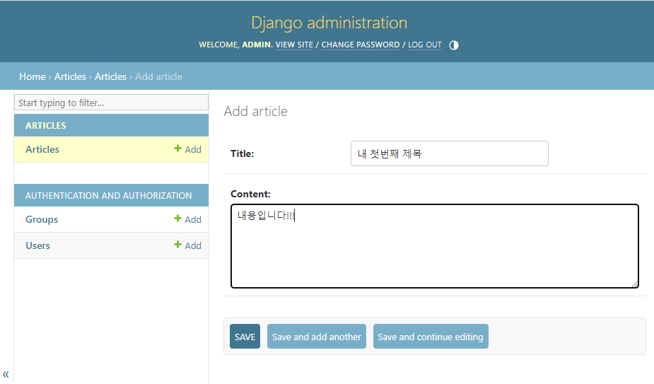

# Django Model

## Model

### Model을 통한 DB(데이터베이스) 관리
- Model은 데이터베이스를 관리하는 역할


- model이 데이터를 받아서 views 함수에서 처리 하게 된다.

### Django Model
- DB의 테이블을 정의하고 데이터를 조작할 수 있는 기능들을 제공
- -> 테이블 구조를 설계하는 '청사진(blueprint)'
- 조작 : 데이터를 생성 / 수정 / 삭제 등을 의미한다

### model 클래스 작성

```python
# articles/models.py

class Article(models.Model):
             # medoles라는 모듈에 Model 이라는 클래스를 상속 받고 있음
    title = models.CharField(max_length = 10)
    # CharField 라는 클래스의 인스턴스
    content = models.TextField()
    # TextField 라는 클래스의 인스턴스
```


### model 클래스 살펴보기
- 작성한 모델 클래스는 최종적으로 DB에 다음과 같은 테이블 구조를 만듦
- models.Model -> 일종의 테이블을 만드는 설계도


- id => 데이터 베이스의 pk가 됨 (장고가 자동생성)
- 1개의 클래스 -> 1개의 데이터 테이블
- 1개의 클래스는 1개의 column을 만든다

- django.db.models 모듈의 Model 이라는 부모 클래스를 상속 받음
- Model은 model에 관련된 모든 코드가 이미 작성되어 있는 클래스
- https://github.com/django/django/blob/main/django/db/models/base.py#L459

- -> 개발자는 가장 중요한 테이블 구조를 어떻게 설계할지에 대해 코드만 작성하도록 하기 위한 것 
- 테이블 생성 시 장고에서 제공하는 클래스 models.Model을 그냥 가져다 쓴다 라고 생각

- 클래스 변수명
  - 테이블의 각 "필드(열) 이름" (데이터에선 열을 필드라고 부름, 행은 레코드라 부름)

- model Field 클래스
  - 테이블 필드의 "데이터 타입"
  - 데이터베이스는 반드시 그 컬럼에 어떠한 데이터가 들어갈지 명시해야 한다.
  - 문자열 타입들만 들어가게 된다.
  - https://docs.djangoproject.com/en/4.2/ref/models/fields/

- model Field 클래스의 키워드 인자 (필드 옵션)
  - 테이블 필드의 "제약조건" 관련 설정


  - 예를 들어 제목에 몇천줄 짜리 제목을 적었을 경우 데이터 관리가 어려워지기 때문에 제약을 걸어둚
  - https://docs.djangoproject.com/en/4.2/ref/models/fields/#field-options

### 제약 조건
- 데이터가 올바르게 저장되고 관리되도록 하기 위한 규칙
- -> ex) 숫자만 저장되도록, 문자가 100자 까지만 저장되도록 하는 등

## Migrations

### Migrations
- model 클래스의 변경사항(필드 생성, 수정 삭제 등)을 DB에 최종 반영하는 방법

### Migrations 과정

- 데이터베이스는 SQL이라는 언어를 사용하기 때문에 중간에 데이터베이스가 이해할 수 있는 최종 설계도로 만들어준다 (makemigrations)
- 최종 설계도를 데이터베이스에 보내는 과정 (migrate)
- 반드시 이 흐름을 유지해야한다.

### Migrations 핵심 명령어 2가지
- $ python manage.py makemigrations
  - model class를 기반으로 최종 설계도(migration) 작성


- $ python manage.py migrate
  - 최종 설계도를 DB에 전달하여 반영


- 새로 생성된 파일을 제외하고 다른 내장 파일들도 존재한다.


- Open Database를 통해 열 수 있음


- 테이블을 설계 했지만 데이터를 작성하지는 않았다

- 장고 파일을 올리거나 주고 받을 때 DB 데이터는 주고 받거나 올리지 않는다
- migrations 파일안에 __pycache__ / __init.py__ 파일을 제외하고 migration 할 때 마다 생성되는 00001_initial / 00002_bula bula 등 새로 생성되는 파일을 주고 받는다

### 이미 생성된 테이블에 필드를 추가해야 한다면?


### 추가 모델 필드 작성


- 제약 조건에 True를 입력한다는 것은 기본 값이 False로 되어 있다.
  

- 이미 설계된 테이블에 바로 추가 빈 필드를 붙이는 것은 불가능하다
- 이미 기존 테이블이 존재하기 때문에 필드를 추가할 때 필드의 기본값 설정이 필요
- 1번은 현재 대화를 유지하면서 직접 기본 값을 확인하는 방법
- 2번은 현재 대화에서 나간 후 models.py에 기본 값 관련 설정을 하는 방법


- 추가하는 필드의 기본 값을 입력해야하는 상황
- 날짜 데이터이기 때문에 직접 입력하기 보다 Django가 제안하는 기본 값을 사용하는 것을 권장
- 아무것도 입력하지 않고 enter를 누르면 Django가 제안하는 기본 값으로 설정 됨


- 1번 설계도에서 새로 추가된 설계도는 1번 설계도에 의지하고 있기 때문에 1번 설계도가 없다면 정상 작동을 하지 않는다.
- migrations 과정 종료 후 2번째 migration 파일이 생성됨을 확인
- 이처럼 Django는 설계도를 쌓아가면서 추후 문제가 생겼을 시 복구하거나 되돌릴 수 있도록 함 (마치 'git commit')


- 확인할 때 migrate 후 새로고침 해줘야함

### model class에 변경사항(1)이 생겼다면, 반드시 새로운 설계도를 생성(2)하고, 이를 DB에 반영(3)해야 한다.
- 1. model class 변경 -> 2. make migrations -> 3. migrate

## 모델 필드

### Model Field
- DB 테이블의 필드(열)을 정의하며, 해당 필드에 저장되는 데이터 타입과 제약조건을 정의

### CharField()
- 길이의 제한이 있는 문자열을 넣을 때 사용
- (필드의 최대 길이를 결정하는 max_length는 필수 인자)
- 문자열 타입

### TextField()
- 글자의 수가 많을 때 사용
- 문자열 타입

### DateTimeField()
- 날짜와 시간을 넣을 때 사용

### DateTimeField의 선택인자
- auto_now : 데이터가 '저장될 때마다' 자동으로 현재 날짜시간을 저장 (수정일)
- auto_now_add : 데이터가 '처음 생성될 때만' 자동으로 현재 날짜시간을 저장 (생성일)

## Admin site
- 최고 권한을 가진 유저

### Automatic admin interface
- Django는 추가 설치 및 설정 없이 자동으로 관리자 인터페이스를 제공
- -> 데이터 확인 및 테스트 등을 진행하는데 매우 유용

### admin 계정 생성
- email은 선택 사항이기 때문에 입력하지 않고 진행 가능
- 비밀번호 입력 시 보안상 터미널에 출력되지 않으니 무시하고 입력 이어가기


- 아이디 비밀번호가 없음


- 유저 네임과 너무 유사하고 비밀번호가 흔하다고 거절 당하는 것은 제약조건 중 하나
- 항상 migrate 과정을 거치고 데이터베이스에 계정을 저장해야한다!


- password는 암호화 처리 해둔다

### admin에 모델 클래스 등록
- admin.py에 작성한 모델 클래스를 등록해야만 admin site에서 확인 가능


- 관리자 페이지에 article table은 보이지 않음
- Django 내장 앱들에 한해서만 admin 페이지에 출력이 됨
- admin.py에서 등록해줘야함


### admin site 로그인 후 등록된 모델 클래스 확인





- 데이터베이스에도 저장이 됨
- 수정 삭제 가능하지만 django는 기본적으로 id를 재사용하지 않는다.

## 참고

### 데이터베이스 초기화
1. migration 파일 삭제
2. db.sqlite3 파일 삭제
- 아래 파일과 폴더를 지우지 않도록 주의
- __init__.py
- __pychae__
- migrations 폴더

### Migrations 기타 명령어
- $ python manage.py showmigrations
- migrations 파일들이 migrate 됐는지 안됐는지 여부를 확인하는 명령어
- [X] 표시가 있으면 migrate가 완료되었음을 의미


- $ python manage.py sqlmigrate articles 0001
- 해당 migrations 파일이 SQL 언어 (DB에서 사용하는 언어)로 어떻게 번역 되어 DB에 전달되는지 확인하는 명령어


### 첫 migrate 시 출력 내용이 많은 이유는?
- Django 프로젝트가 동작하기 위해 미리 작성되어 있는 기본 내장 app들에 대한 migration 파일들이 함께 migrate 되기 때문


### SQLite
- 데이터베이스 관리 시스템 중 하나이며 Django의 기본 데이터베이스로 사용됨
  (파일로 존재하며 가볍고 호환성이 좋음)

### CRUD
- 소프트웨어가 가지는 기본적인 데이터 처리 기능
- Create (저장)
- Read (조회)
- Update (갱신)
- Delete (삭제)