# Django : ORM

## ORM

### ORM
- Object-Related-Mapping
- 객체 지향 프로그래밍 언어를 사용하여 호환되지 않는 유형의 시스템 간에 데이터를 변환하는 기술

### ORM의 역할
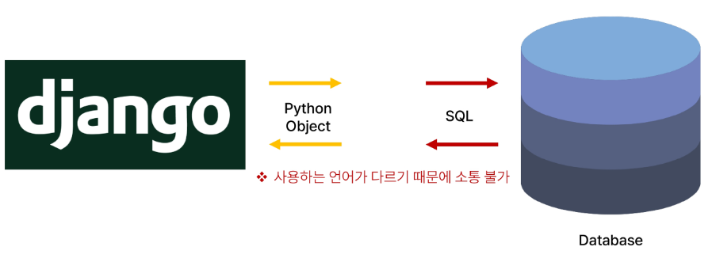
- django는 Python 언어
- Database는 SQL 언어 이기 떄문에 서로 소통이 어려움
- 번역기 역할

## QuerySet API
- ORM에서 데이터를 검색, 필터링, 정렬 및 그룹화 하는데 사용하는 도구
- -> API를 사용하여 SQL이 아닌 Python 코드로 데이터를 처리
- 데이터를 CRUD 하기 위한 도구

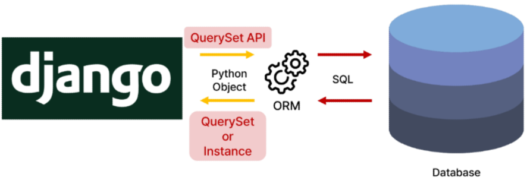

- QuerySet : 다중 데이터 / Instance : 단일 데이터

### QuerySet API 구문

- Article.      objects.     all() 
  Model class / Manager / Queryset API (메서드)
- Manager가 method를 가지고 있다라고 생각
- class.Manager.method
- 이 구문을 ORM이 해석을 해서 SQL 언어로 Database로 전달

### Query
- 데이터베이스에 특정한 데이터를 보여 달라는 요청
- "쿼리문을 작성한다."
- -> 원하는 데이터를 얻기 위해 데이터베이스에 요청을 보낼 코드를 작성한다.
- 파이썬으로 작성한 코드가 ORM의 의해 SQL로 변환되어 데이터베이스에 전달되며, 데이터베이스의 응답데이터를 ORM이 QuerySet이라는 자료 형태로 변환하여 우리에게 전달

### QuerySet
- 데이터베이스에게서 전달 받은 객체 목록(데이터 모음)
  - 순회가 가능한 데이터로써 1개 이상의 데이터를 불러와 사용할 수 있음
- Django ORM을 통해 만들어진 자료형
- 단, 데이터베이스가 단일한 객체를 반환 할 때는 QuerySet이 아닌 모델(Class)의 인스턴스로 반환됨
- QuerySet과 Model의 instance 형태로만 주고 받는다
- 순회가 가능하다

### Python의 모델 클래스와 인스턴스를 활용해 DB에 데이터를 저장, 조회, 수정, 삭제하는 것

## QuerySet API 실습

## Create

### QuerySet API 실습 사전 준비
- 외부 라이브러리 설치 및 설정
- $ pip install ipython
- $ pip install django-extensions

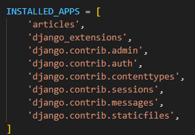
- django_extensions 등록

- 앱 등록 권장 순서 : 1. normal app 2. third party app (외부 앱) 3. django app

### Django shell
- Django 환경 안에서 실행되는 python shell
- (입력 하는 QuerySet API 구문이 Django 프로젝트에 영향을 미침)
- django-extensions third party app의 shell_plus를 사용함

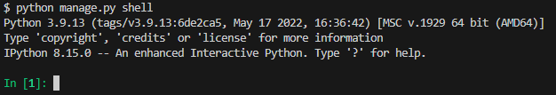
- 기존의 shell

### 첫번째 방법

- shell_plus
- 기본적으로 import가 많이 되어 있음 / 자동완성 기능에서도 차이가 있음
- 데이터를 생성하기 위해서 model class를 통해서 instance를 생성

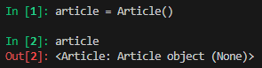

- class와 instance 문법으로 게시글 작성
- instance 변수를 class 변수와 동일하게 만듦

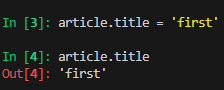

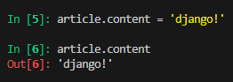

- instance 변수만 작성한다고 테이블이 만들어지지 않는다.
- 저장하는 행동이 필요 (메서드)

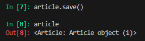

- ORM에 python method 를 통해서 전달을 하면 SQL로 해석을 하여 Database에 전달하게 된다.

.PNG)
- 전체 조회문
- 대괄호가 쳐져 있기 때문에 리스트 '처럼' 활용할 수 있을 것
- all() 이라는 명령어 자체가 전체를 요구하는 명령어 이기 때문에 개수에 상관없이 type은 QuerySet이다

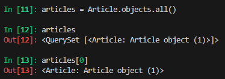
- QuerySet은 인덱스를 통해서 접근해야 한다

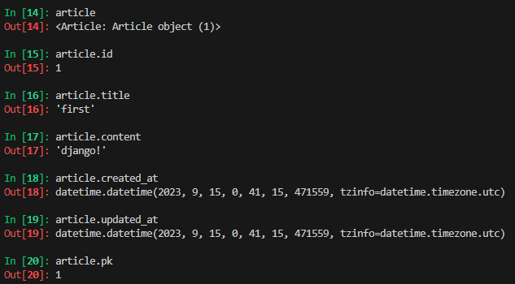
- 저장이 되어 있기 때문에 데이터를 확인할 수 있다
- pk : primary key (id를 확인 가능)

### 두번째 방법

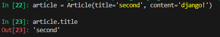

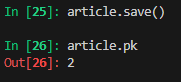

- 인스턴스 생성할 때 인자값으로 넣음

### 세번쨰 방법
- Article.objects.create()

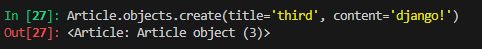

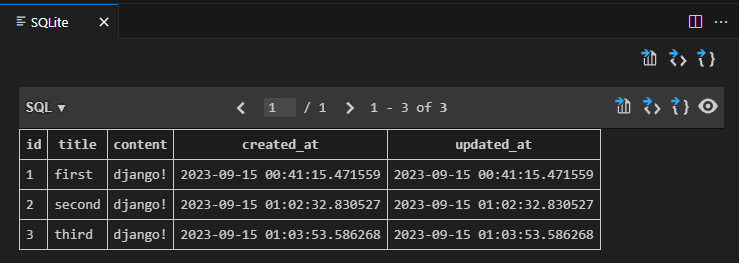
- return 값이 존재 / 저장의 과정이 없어도 save 기능이 포함되어 있음

### save()
- 객체를 데이터베이스에 저장하는 메서드 (인스턴스가 호출하기 때문에 인스턴스 메서드)

## Read
- 조회

### all()
- 전체 데이터 조회

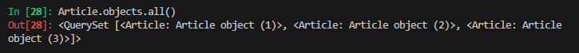

- 반복을 활용하여 조회를 할 수 있다.

### get()
- 단일 데이터 조회

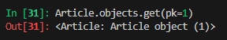

- 존재하지 않는 데이터를 조회하려 할 때

- content 내용을 모두 django로 출력 했기 때문에 Article.objects.get(content='django!')를 하려 할 때 중복을 처리 할 수 없음

- 따라서 pk 값이 중요! / 절대 겹치지 않는 값

### get() 특징
- 객체를 찾을 수 없으면 DoesNotExist 예외를 발생시키고, 둘 이상의 객체를 찾으면 MultipleObjectsReturned 예외를 발생시킴

- -> 위와 같은 특징을 가지고 있기 때문에 'primary key와 같이 고유성 (uniqueness)을 보장하는 조회에서 사용' 해야함

### filter()
- 특정 조건 데이터 조회 (다중 데이터 조회)

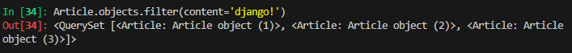
- 다중 데이터이기 때문에 QuerySet으로 출력

- 조건이 전부 만족하지 않을 때

- 빈 QuerySet 출력

- 단일 데이터 출력할 때
  

- 단일이여도 QuerySet 으로 출력

## Update
- 무언가 수정을 해야할 때 조회를 먼저 이루어져야 한다.

### 데이터 수정
- 인스턴스 변수를 변경 후 save 메서드 호출

- 수정할 인스턴스 조회

- 인스턴스 변수를 변경

- 저장

### 데이터 삭제
- 삭제하려는 데이터 조회 후 delete 메서드 호출

- 삭제할 인스턴스 조회

- delete 메서드 호출 (삭제된 객체가 반환)

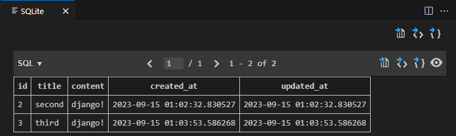

- 데이터 복구는 데이터베이스에서 제공하는 추가 기능을 활용하지 않는 이상 복구가 힘들다.

## 참고

https://docs.djangoproject.com/en/4.2/ref/models/querysets/

- queryset 공식문서

### Field lookups
- 특정 레코드에 대한 세부적인 조건을 설정하는 방법
- QuerySet 메서드 filter(), exclude() 및 get()에 대한 키워드 인자로 지정됨
- https://docs.djangoproject.com/en/4.2/ref/models/querysets/-field-lookups

### ORM, QuerySet API를 사용하는 이유
- 데이터베이스 쿼리를 추상화하여 Django 개발자가 데이터베이스와 직접 상호작용하지 않아도 되도록 함
- 데이터베이스와의 결합도를 낮추고 개발자가 더욱 직관적이고 생산적으로 개발할 수 있도록 도움

### 제약 조건 어기기

- 파이썬 코드로 제약조건을 어겼을 때 아무 문제가 없는데 원래는 저장 전에 '유효성 검사' 과정을 거쳐야 문제가 생기지 않는다