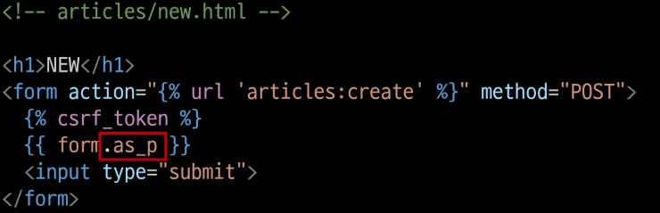
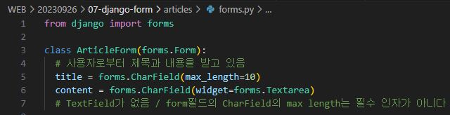
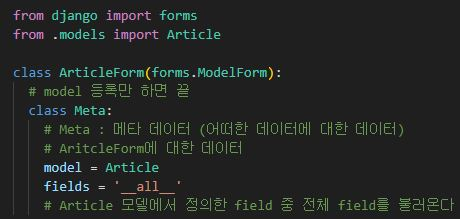
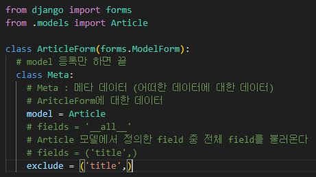
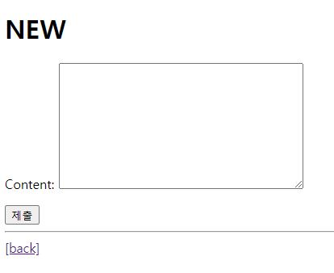
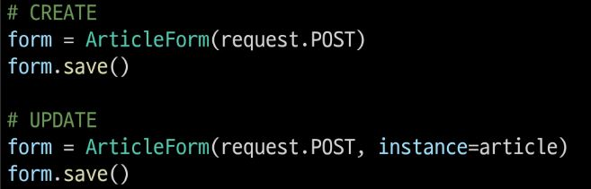

# Django Form

## 개요

### HTML 'form'
- 지금까지 사용자로부터 데이터를 받기위해 활용한 방법 그러나 비정상적 혹은 악의적인 요청을 필터링 할 수 없음
- -> 유효한 데이터인지에 대한 확인이 필요

### 유효성 검사
- 수집한 데이터가 정확하고 유효한지 확인하는 과정

### 유효성 검사 구현
- 유효성 검사를 구현하기 위해서는 입력 값, 형식, 중복, 범위, 보안 등 많은 것들을 고려해야함
- 이런 과정과 기능을 적접 개발하는 것이 아닌 Django가 제공하는 Form을 사용

## Django Form

## Form Class

### Django Form
- 사용자 입력 데이터를 수집하고, 처리 및 유효성 검사를 수행하기 위한 도구
- -> 유혀성 검사를 단순화하고 자동화 할 수 있는 기능을 제공

### Form class 정의
- 데이터를 수집하고 유형성 검사를 하는 과정은 신경쓰지 않아도 된다
- 사용자로부터 어떤 데이터를 받을지가 중요
- models.py 와 사용방식은 크게 다르지 않다
- 보통 forms.py를 만들어서 사용

- form class로 form tag를 대체할 예정

- 긴 form 태그를 대체할 수 있다

### Form rendering options
- label, input쌍을 특정 HTML 태그로 감싸는 옵션

## Widgets
- HTML 'input' element의 표현을 담당
  
### Widget 사용
- Widget은 단순히 input 요소의 속성 및 출력되는 부분을 변경하는 것
- https://docs.djangoproject.com/ko/4.2/ref/forms/widgets/#built-in-widgets

## Django ModelForm

### Form
- 사용자 입력 데이터를 DB에 저장하지 않을 때 (ex. 로그인)

### ModelForm
- 사용자 입력 데이터를 DB에 저장해야 할 때 (ex. 게시글, 회원가입)

### ModelForm
- Model과 연결된 Form을 자동으로 생성해주는 기능을 제공
- -> Form + Model

- modelform에 등록하는 과정
- 등록된 model을 해석을 한다

### Meta class
- ModelForm의 정보를 작성하는 곳

### 'fields' 및 'exclude' 속성
- exclude 속성을 사용하여 모델에서 포함하지 않을 필드를 지정할 수도 있음

### ModelForm을 적용한 create 로직

- redirect를 하게 될 경우 New page를 다시 받게 됨

- render를 통해 에러메세지를 포함한 페이지를 새롭게 렌더링 하게 된다

- save()도 return 값이 있기 때문에 detail page로 redirect를 할 수 있다

### is_valid()
- 여러 유효성 검사를 실행하고, 데이터가 유효한지 여부를 Boolean으로 반환
- 빈 값은 허용하지 않는다 (모든 필드의 기본적인 유효성 여부)
- https://docs.djangoproject.com/en/4.2/ref/validators/

### 공백 데이터가 유효하지 않은 이유와 에러메시지가 출력되는 과정
- 별도로 명시하지 않았지만 모델 필드에는 기본적으로 빈 값은 허용하지 않는 제약조건이 설정되어있음
- 빈 값은 is_valid()에 의해 False로 평가되고 form 객체에는 그에 맞는 에러 메시지가 포함되어 다음 코드로 진행됨

### ModleForm을 적용하는 edit 로직

- instance 인자에 기존의 값들을 받아야 한다.

### ModelForm을 적용한 update 로직

- views 에서 create와 update의 차이가 없어 수정이 되는 것이 아닌 새로운 글이 작성이 되어 버림

- instance 값이 있어야 수정하는 것을 인식함

### save()
- 데이터베이스 객체를 만들고 저장

### save() 메서드가 생성과 수정을 구분하는 법
- 키워드 인자 instance 여부를 통해 생성할지, 수정할 지를 결정

### Django Form 정리
- "사용자로부터 데이터를 수집하고 처리하기 위한 강력하고 유연한 도구"
- HTML form의 생성, 데이터 유효성 검사 및 처리를 쉽게 할 수 있도록 도움

## 참고

### ModelForm 키워드 인자 data와 instance 살펴보기
- https://github.com/django/django/blob/main/django/forms/models.py#L341

- instance 보다 상위 부모가 존재하기 때문에 instance를 사용하지 않을 경우 두번째 file로서 받아져서 에러가 발생한다
- 따라서 최상위 부모인 data는 생략이 가능

### Widget 응용

- widget을 응용하여 bootstrap 커스텀을 할 수 있게 된다

## Handling HTTP requests

## view 함수 구조 변화

### new & create view 함수간 공통점과 차이점
1. 공통점
   - 목적이 같다. (게시글을 생성하기 위함)
   - "데이터 생성을 구현하기 위함"
2. 차이점
   - new는 template만 rendering함 create DB와 연동함
   - new는 조회만 함 create는 생성을 함
   - "new는 GET method 요청만을, create는 POST method 요청만을 처리"

- 분기점을 만들어서 지금 들어온 요청에 대해 GET과 POST를 나눠서 받아 하나의 view 함수로 합칠 수 있다

## HTTP request method 차이점을 활용해 view 함수 구조 변경

### new & create 함수 결합

- GET이 아닌 다른 메서드도 존재하기 때문에 분기점은 POST를 기준으로 하게 된다

- new와 create view 함수으,ㅣ 공통점과 차이점을 기반으로 하나의 함수로 결합
- 두 함수의 유일한 차이점이었던 request method에 따른 분기
- POST 일 때는 과거 create 함수 구조였던 객체 생성 및 저장 로직 처리
- POST가 아닐 때는 과거 단순히 form 인스턴스 생성
- context에 담기는 form은
  1. is_valid를 통과하지 못해 에러메시지를 담은 form이거나ㅣ
  2. else문을 통한 form 인스턴스

### 기존 new 관련 코드 수정
- 사용하지 않는 new url 제거

- a 태그는 GET 요청만 보낼 수 있다

### request method에 따른 요청 변화
- (GET) articles/create/ 게시글 생성 문서를 줘!
- (POST) articles/create/ 게시글을 생성해줘!

### 새로운 update view 함수
- 기존 eidt과 update view 함수 결합

- url 수정 -> views 수정 -> edit.html을 update.html로 변경 -> detail.html 수정
