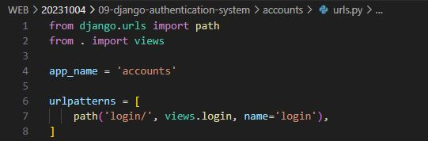

# Django Authentication System 1

## Cookie & Session

### 개요
- 우리가 서버로부터 받은 페이지를 둘러볼 때 우리는 서버와 서로 연결되어 있는 상태가 아니다

### HTTP
- HTML 문서와 같은 리소스들을 가져올 수 있도록 해주는 규약
- 웹(www)에서 이루어지는 모든 데이터 교환의 기초

### HTTP 특징
1. 비연결지향 (connectionless)
   - 서버는 요청에 대한 응답을 보낸 후 연결을 끊음

2. 무상태(stateless)
   - 연결을 끊는 순간 클라이언트와 서버 간의 통신이 끝나며 상태 정보가 유지되지 않음

### 상태가 없다는 것은.
- 장바구니에 담은 상품을 유지할 수 없음
- 로그인 상태를 유지할 수 없음
- ...

## 쿠키

### 쿠키 (Cookie)
- 서버가 사용자의 웹 브라우저에 전송하는 작은 데이터 조각
- -> 클라이언트 측에서 저장되는 작은 데이터 파일이며, 사용자 인증, 추적, 상태 유지 등에 사용되는 데이터 저장 방식

### 쿠키 사용 예시
1. 메인페이지에 대한 요청을 보냄
2. 서버에서 브라우저에 페이지와 쿠키를 보냄
3. 같은 서버에 다른 페이지로 재요청시마다 받고 저장해 놓았던 쿠키를 함께 전송

### 쿠키 사용 원리
1. 브라우저(클라이언트)는 쿠키를 KEY-VALUE의 데이터 형식으로 저장
2. 이렇게 쿠키를 저장해 놓았다가, 동일한 서버에 재요청 시 저장된 쿠키를 함께 전송
   -> 쿠키는 두요청이 동일한 브라우저에서 들어왔는지 아닌지를 판단할 때 주로 사용됨
    - 이를 사용해 사용자의 로그인 상태를 유지할 수 있음
    - 상태가 없는(stateless) HTTP 프로토콜에서 상태 정보를 기억시켜 주기 때문

### 쿠키를 이용한 장바구니 예시
- 장바구니에 상품 담기
  

- 개발자 도구 - Network 탭 - cartView.pang 확인
- 서버는 응답과 함께 Set-Cookie 응답 헤더를 브라우저에게 전송
  - 이 헤더는 클라이언트에게 쿠키를 저장하라고 전달하는 것

- Cookie 데이터 자세히 확인

- 메인 페이지 이동 - 장바구니 유지 상태 확인

- 개발자 도구 - Application 탭 - Cookies
- 마우스 우측 버튼 - Clear - 새로고침 - 장바구니가 빈 것을 확인

### 쿠키 사용 목적
1. 세션 관리 (Session management)
   - 로그인, 아이디 자동완성, 공지 하루 안 보기, 팝업 체크, 장바구니 등의 정보 관리

2. 개인화 (Personalization)
   - 사용자 선호, 테마 등의 설정

3. 트래킹 (Tracking)
   - 사용자 행동을 기록 및 분석

### 세션 (Session)
- 서버측에서 생성되어 클라이언트와 서버 간의 상태를 유지
- 상태 정보를 저장하는 데이터 저장 방식
- -> 쿠키에 세션 데이터를 저장하여 매 요청시마다 새션 데이터를 함께 보냄

### 세션 작동 원리
1. 클라이언트가 로그인을 하면 서버거 session 데이터를 생성 후 저장
2. 생성된 session 데이터에 인증할 수 있는 session id (일종의 key)를 발급
3. 발급한 session id를 클라이언트에게 응답
4. 클라이언트는 응답 받은 session id를 쿠키에 저장
5. 클라이언트가 다시 동일한 서버에 접속하면 요청과 함께 쿠키(session id가 저장된)를 서버에 전달
6. 쿠키는 요청 때마다 서버에 함께 전송 되므로 서버에서 session id를 확인해 로그인 되어 있다는 것을 알도록 함 (쿠키에 session id가 누락된다면 다음 요청에서 로그아웃을 시키게 된다)

### 정리
- 서버 측에서는 세션 데이터를 생성 후 저장하고 세션 ID를 생성
- 이 ID를 클라이언트 측으로 전달하여, 클라이언튼느 쿠키에 이 ID를 저장
- 서버로부터 쿠키를 받아 브라우저에 저장하고, 클라리언트가 같은 서버에 재요청 시마다 저장해 두었던 쿠키도 요청과 함께 전송
- -> 예를 들어 로그인 상태 유지를 위해 로그인 되어있다는 사실을 입증하는 데이터를 매 요청마다 계속해서 보내는 것

### 쿠키와 세션의 목적
- 서버와 클라이언트 간의 상태를 유지

## 참고

### 쿠키 종류별 Lifetime (수명)
1. Session cookie
   - 현재 세션 (current session)이 종료되면 삭제됨
   - 브라우저 종료와 함께 세션이 삭제됨

2. Persistenet cookies
   - Expires 속성에 지정된 날짜 혹은 Max-Age 속성에 지정된 기간이 지나면 삭제됨

### 세션 in Django
- Djnago는 'database-backed sessions' 저장 방식을 기본 값으로 사용
- session 정보는 DB의 django_session 테이블에 저장
- Django는 특정 session id를 포함하는 쿠키를 사용해서 각각의 브라우저와 사이트가 연결된 session을 알아냄
- Django는 우리가 session 메커니즘(복잡한 동작원리)에 대부분을 생각하지 않게끔 많은 도움을 줌

## Authentication System

### Django Authentication System (인증 시스템)
- 사용자 인증과 관련된 기능을 모아 놓은 시스템

### Authentication (인증)
- 사용자가 자신이 누구인지 확인하는 것 (신원 확인)

### 사전 준비
- 두 번째 app accounts 생성 및 등록
- auth와 관련한 경로나 키워드들을 django 내부적으로 accounts라는 이름으로 사용하고 있기 때문에 되도록 'accounts'로 지정하는 것을 권장

- 앱 생성 후 등록

- url 계층 나누기

- 앱 내의 url 사전 준비

## Custom User model

### Custom User model로 '대체'하기
- django가 기본적으로 제공하는 User model은 내장된 auth 앱의 User 클래스를 사용

### User 클래스를 대체하는 이유
- 우리는 지금까지 별도의 User 클래스 정의 없이 내장된 User 클래스를 사용했음
- 별도의 설정 없이 사용할 수 있어 간편하지만, 개발자가 '직접 수정할 수 없는 문제가 존재'
- https://github.com/django/django/blob/main/django/contrib/auth/models.py#L405

- admin 페이지에서 추가적으로 넣을 수 있는 정보들

- 우리가 직접 User 클래스를 만들고 AbstractUser만 상속받는다

### 대체하기
- AbstractUser를 상속받는 커스텀 User 클래스 작성
- -> 기존 User 클래스도 AbatractUser를 상속받기 때문에 '커스텀 User 클래스도 기존 User 클래스와 완전히 같은 모습을 가지게 됨'

- accounts 앱에 models.py에 작성

- django 프로젝트가 사용하는 기본 User 모델을 우리가 작성한 User 모델로 지정
- 수정 전 기본 값은 'auth.User'

- 프로젝트 settings.py에 작성

- auth 앱에 있는 유저 모델을 사용하지 않을 거고 우리가 작성한 User 모델로 대체를 하겠다 선언

- 기본 User 모델이 아니기 때문에 등록하지 않으면 admin site에 출력되지 않음

- https://docs.djangoproject.com/en/4.2/topics/auth/customizing/

### *주의*
- 프로젝트 중간에 AUTH_USER_MODEL을 변경할 수 없음
- 프로젝트 제일 처음에 custom 해야 한다
- 이미 프로젝트가 진행되고 있을 경우 데이터베이스 초기화 후 진행

### 프로젝트를 시작하며 반드시 User 모델을 대체해야 한다.
- Django는 새 프로젝트를 시작하는 경우 비록 기본 User 모델이 충분 하더라도 커스텀 User 모델을 설정하는 것을 강력하게 권장하고 있음
- 커스텀 User 모델은 기본 User 모델과 동일하게 작동 하면서도 '필요한 경우 나중에 맞춤 설정할 수 있기 때문'

- *단, User 모델 대체 작업은 프로젝트의 모든 migrations 혹은 첫 migrate를 실행하기 전에 이 작업을 마쳐야함*

## Login
- Session을 Create 하는 과정
- article에서 create 했던 코드와 굉장히 유사한 코드를 사용함
- built-in form을 사용함

### AuthenticationForm()
- 로그인 인증에 사용할 데이터를 입력 받는 bulilt-in form
- model form이 아닌 그냥 form
- 로그인에 활용되는 데이터는 인증에 활용되고 DB에 저장하는 행위는 하지 않기 때문에 form 형태
- 회원가입은 DB에 저장되기 때문에 model form 형태

- if POST 이후 세션 데이터 생성
- views 함수명도 login import 한 것도 login 이기 때문에 별칭으로 auth_login으로 설정
- django에선 일반적으로 import 명을 바꿔줌
  
- login(request, user)
  - AuthenticationForm을 통해 인증된 사용자를 로그인 하는 함수

- get_user()
  - AuthenticationForm의 인스턴스 메서드
  - -> 유효성 검사를 통과했을 경우 로그인 한 사용자 객체를 반환

- views 함수의 최종 형태는 크게 바뀌지 않는다 / 근본적인 틀은 같다

- admin 아이디 생성을 하여 확인하기 / 로그인이 잘 됐을 때 메인페이지로 이동
- 로그인이 성공했다는 것은 session이 만들어지고 쿠키데이터에 session이 만들어져 있다면 성공

### 세션 데이터 확인하기

1. 로그인 후 발급받은 세션 확인
   - django_session 테이블에서 확인

- django 내에서 알아서 session key를 생성해줌

2. 브라우저에서 확인
   - 개발자도구 - Application - Cookies
  

- 유효기간이 있는 쿠키

### 로그인 링크 작성

## Logout
- Session을 Delete 하는 과정

### logout(request)
- 현재 요청에 대한 Session Data를 DB에서 삭제
- 클라이언트의 쿠키에서도 Session Id를 삭제

### 로그아웃 로직 작성

### 로그아웃 진행 및 세션 데이터 삭제 확인

## Template with Authentication data
- 템플릿에서 인증 관련 데이터를 출력하는 방법

### context processors
- 템플릿이 렌더링 될 때 호출 가능한 컨텍스트 데이터 목록
- 작성된 컨텍스트 데이터는 기본적으로 템플릿에서 사용 가능한 변수로 포함됨
- 즉, django에서 자주 사용하는 데이터 목록을 미리 템플릿에 로드 해 둔 것

## 참고

### github 코드 참고
- AuthenticationForm()
  - https://github.com/django/django/blob/main/django/contrib/auth/forms.py#L199

- AuthenticationForm의 get_user 인스턴스 메서드
  - https://github.com/django/django/blob/main/django/contrib/auth/forms.py#L269

### User 모델 상속 관계

### 'AbstractUser' class
- "관리자 권한과 함께 완전한 기능을 가지고 있는 User model을 구현하는 추상 기본클래스"

### Abstract base calsses (추상 기본 클래스)
- 몇 가지 공통 정보를 여러 다른 모델에 넣을 때 사용하는 클래스 (틀 역할)
- 데이터베이스 테이블을 만드는데 사용되지 않으며, 대신 다른 모델의 기본 클래스로 사용되는 경우 해당 필드가 하위 클래스 필드에 추가됨
- https://docs.python.org/3/library/abc.html

### 유저 모델 대체하기 Tip
- 유저 모델을 대체하는 순서를 숙지하기 어려울 경우 해당 공식문서를 보며 순서대로 진행하는 것을 권장
- https://docs.djangoproject.com/en/4.2/topics/auth/customizing/#substituting-a-custom-user-model

