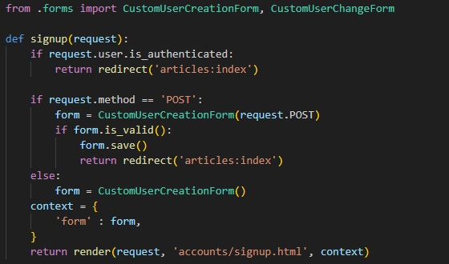
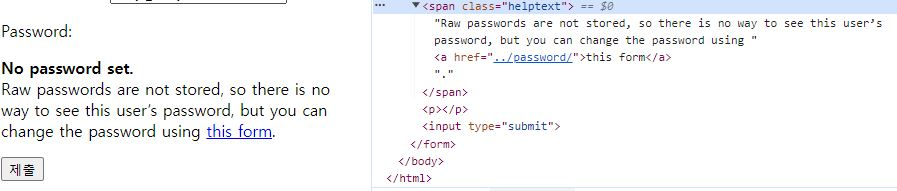
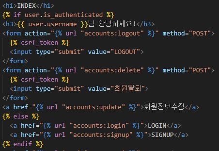
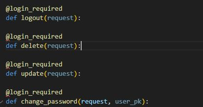

# Django : Authentication System2

## 회원 가입
- User 객체를 Create 하는 과정

### UserCreationForm()
- 회원 가입 시 사용자 입력 데이터를 받을 built-in ModelForm

### 회원 가입 페이지 작성

### 회원 가입 로직 에러

- Manager isn't availavle; 'auth.User' has been swapped for 'accounts.User'
- 회원가입에 사용하는 UserCreationForm이 우리가 대체한 커스텀 유저 모델이 아닌 기존 유저 모델로 인해 작성된 클래스이기 때문

- https://github.com/django/django/blob/main/django/contrib/auth/forms.py#L84

### 커스텀 유저 모델을 사용하려면 다시 작성해야 하는 Form
- UserCreationForm
- UserChangeForm
- 두 Form 모두 class Meta: model = User가 작성된 Form 이기 때문
- 회원 수정 form인 changeform도 수정해줘야 한다

### 회원 가입 로직 작성
- 회원 가입 로직 작성

### get_user_model()
- "현재 프로젝트에서 활성화된 사용자 모델(active user model)"을 반환하는 함수
  
### User 모델을 직접 참조하지 않는 이유
- get_user_model()을 사용해 User 모델을 참조하면 커스텀 User 모델을 자동으로 번환해주기 때문

- Django는 User 클래스를 직접 참조하는 대신 get_user_model()을 사용해 참조해야 한다고 필수적으로 강조하고 있ㅇ므

- -> User model 참조에 대한 자세한 내용은 추후 모델 관계에서 다룰 예정

## 회원 탈퇴
- User 객체를 Delete 하는 과정
- Logout은 Session을 제거하는 과정

### 회원 탈퇴 로직 작성

- DB 자체에서 정보를 삭제함
  
## 회원정보 수정
- User 객체를 Update 하는 과정

### UserChangeForm()
- 회원정보 수정 시 사용자 입력 데이터를 받을 built-in ModelForm

### 회원정보 수정 페이지 작성

### UserChangeForm 사용 시 문제점
- User 모델의 모든 정보들(fields)까지 모두 출력되어 수정이 가능하기 때문에 일반 사용자들이 접근해서는 안되는 정보는 출력하지 않도록 해야함
  

- -> CustomUserChangeForm에서 접근 가능한 필드를 조정

- User Model의 필드 목록 확인
- https://docs.djangoproject.com/en/4.2/ref/contrib/auth/

### CustomUserChangeForm 출력 필드 재정의

## 비밀번호 변경
- 인증된 사용자의 Session 데이터를 Update 하는 과정
- 단, 장고 버젼 4.2 이상일 때 url이 pk/password로 연결됨!

### PasswordChangeForm()
- 비밀번호 변경 시 사용자 입력 데이터를 받을 built-in Form
  
### 비밀번호 변경 페이지 작성
- django는 비밀번호 변경 페이지를 회원정보 수정 form에서 별도 주소로 안내
- /user_pk/password/

- project url에 작성

### 비밀번호 변경 로직 작성

- instance 인자를 따로 받지 않음

- 비밀번호 변경 시 로그아웃 됨
- Django에선 기본적으로 암호 변경 시 세션을 무효화 시킴

## 세션 무효화 방지하기

### 암호 변경 시 세션 무효화
- 비밀번호가 변경되면 기존 세션과의 회원 인증 정보가 일치하지 않게 되어 버려 로그인 상태가 유지되지 못하고 로그아웃 처리됨
- 비밀번호가 변경되면서 기존 세션과의 회원 인증 정보가 일치하지 않기 때문

### update_session_auth_hash(request, user)
- 암호 변경 시 세션 무효화를 막아주는 함수
- -> 암호가 변경되면 새로운 password의 Session Data로 기존 session을 자동으로 갱신

## 인증된 사용자에 대한 접근 제한

### 로그인 사용자에 대해 접근을 제한하는 2가지 방법
1. is_authenticated 속성
2. login_required 데코레이터

### is_authenticated
- 사용자가 인증 되었는지 여부를 알 수 있는 User model의 속성
- -> 모든 User 인스턴스에 대해 항상 True인 읽기 전용 속성이며, 비인증 사용자에 대해서는 항상 False

### is_authenticated 적용하기
- 로그인과 비로그인 상태에서 화면에서 출력되는 링크를 다르게 설정하기

- 인증된 사용자라면 로그인/회원가입 로직을 수행할 수 없도록 하기

### login_required
- 인증된 사용자에 대해서만 view 함수를 실행시키는 데코레이터
- -> 비인증 사용자의 경우 /accounts/login/ 주소로 redirect 시킴

### login_required 적용하기
- 인증된 사용자만 게시글을 작성/수정/삭제 할 수 있도록 수정
  

- 인증된 사용자만 로그아웃/탈퇴/수정/비밀번호 변경할 수 있도록 수정

