# Many to one relationships1

## 개요

### Many to one relationships
- N:1 or 1:N
- 한 테이블의 0개 이상의 레코드가 다른 테이블의 레코드 한 개와 관련된 관계
- 다대일 혹은 일대다 관계

### Commnet - Article
- 0개 이상의 댓글은 1개의 게시글에 작성 될 수 있다.
- (게시글의 테이블과 댓글의 테이블이 각각 있다)
- Comment (N) : Article (1)

### 테이블 관계

- 외래 키를 통해 논리적인 관계를 이룬다.

- N:1 관계에서 외래키는 N이 들고 있다.

### ForeignKey()
- N:1 관계 설정 모델 필드

## 댓글 모델 구현

### 댓글 모델 정의
- ForeignKey() 클래스의 인스턴스 이름은 참조하는 모델 클래스 이름의 '단수형'으로 작성하는 것을 권장
- ForeignKey 클래스를 작성하는 위치와 관계없이 외래 키는 테이블 필드 마지막에 생성됨
- 댓글도 게시판의 일부이기 때문에 게시글 작성 application에 작성하는게 적합하다.

### ForeignKey(to, on_delete)
- to : 참조하는 모델 class 이름
- on_delete : 외래 키가 참조하는 객체(1)가 사라졌을 때, 외래 키를 가진 객체(N)를 어떻게 처리할 지를 정의하는 설정 (데이터 무결성의 원칙)

### on_delete의 'CASCADE;
- 부모 객체(참조 된 객체)가 삭제 됐을 때 이를 참조하는 객체도 삭제
- 기타 설정 값 참고
  - https://docs.djangoproject.com/en/4.2/ref/models/fields/#arguments

### Migration
- 댓글 테이블의 article_id 필드 확인
- 참조하는 클래스 이름의 소문자(단수형)로 작성하는 것이 권장 되었던 이유
  - -> '참조 대상 클래스 이름' + '_' + '클래스 이름'

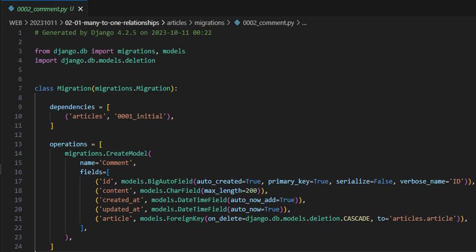

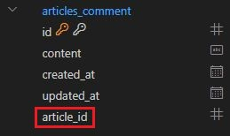

## 댓글 생성 연습

### shell_plus 실행 및 게시글 작성

### 댓글 생성

- Comment 클래스의 인스턴스 comment 생성
- 인스턴스 변수 저장
- DB에 댓글 저장

- 에러 발생
- articles_comment 테이블의 ForeignKeyField, article_id 값이 저장 시 누락되었기 때문
- 어떤 게시글에 작성이 되는 댓글인지에 대한 정보가 누락되었다

- 게시글 조회
- 외래 키 데이터 입력
- 또는 comment.article_id = article.pk 처럼 pk 값을 직접 외래 키 컬럼에 넣어 줄 수도 있지만 권장하지 않음
- 댓글 저장 및 확인

### comment 인스턴스를 통한 article 값 참조하기

- 클래스 변수명인 article로 조회 시 해당 참조하는 게시물 객체를 조회할 수 있음
- N이 1을 참조하는 건 당연하고 쉽다 (애초에 외래 키를 N이 들고 있기 때문)

### 두번째 댓글 생성

- 초기값을 넣어서 생성

## 관계 모델 참조

### 역참조
- N:1 관계에서 1에서 N을 참조하거나 조회하는 것
- -> N은 외래 키를 가지고 있어 물리적으로 참조가 가능하지만 1은 N에 대한 참조 방법이 존재하지 않아 별도의 역참조 이름이 필요
- 해당 게시글에 작성된 모든 댓글을 조회

### 역참조 사용 예시
- article.comment_set.all()
- 모델인스턴스.related manager(역참조 이름).QuerySet API

### related manager
- N:1 혹은 M:N(다대다) 관계에서 역참조 시에서 사용하는 매니저
- -> 'objects' 매니저를 통해 queryset api를 사용했던 것처럼 related manager를 통해 queryset api를 사용할 수 있게 됨

### related manager 이름 규칙
- N:1 관계에서 생성되는 Related manager의 이름은 참조하는 "모델명_set" 이름 규칙으로 만들어짐
- 해당 댓글의 게시글(Comment -> Article)
  - comment.article
- 게시글의 댓글 목록(Article -> Comment)
  - article.comment_set.all()

### Related manager 연습

## 댓글 구현

## 댓글 CREATE

### 댓글 CREATE 구현

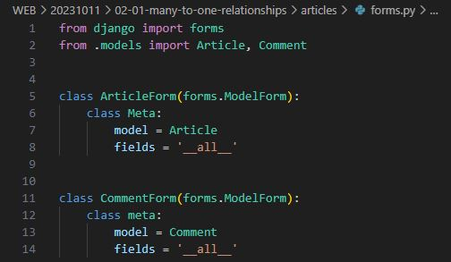

- 사용자로부터 댓글 데이터를 입력 받기 위한 CommentForm 정의

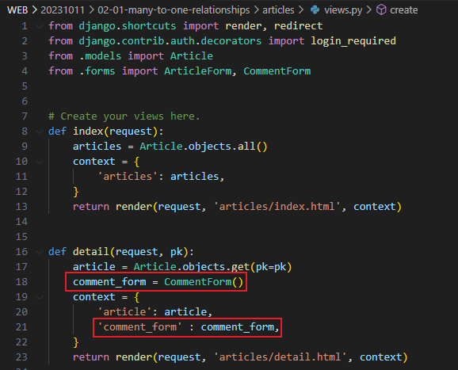

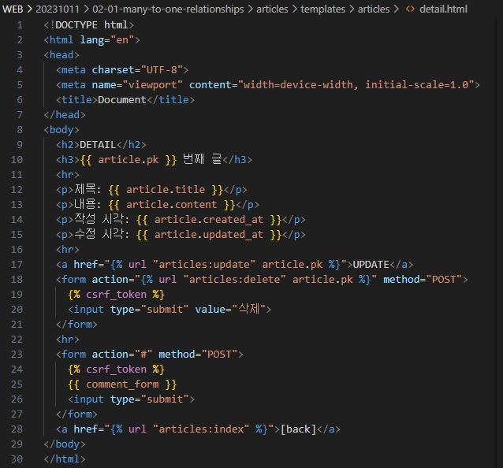

- detail view 함수에서 CommentForm을 사용하여 detail 페이지에 렌더링

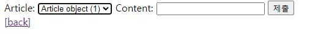

- Comment 클래스의 외래 키 필드 article 또한 데이터 입력이 필요한 필드이기 때문에 출력되고 있는 것
- 하지만, 외래 키 필드는 '사용자 입력 값으로 받는 것이 아닌 view 함수 내에서 다른 방법으로 전달 받아 저장' 되어야 함

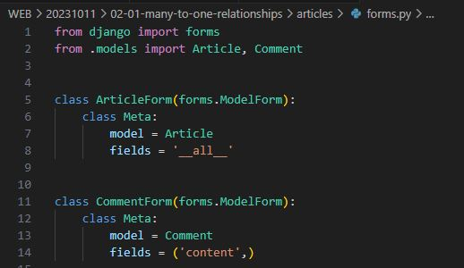

- CommentForm의 출력 필드 조정

- 출력에서 제외된 외래 키 데이터는 어디서 받아와야 할까?
- detail 페이지의 url / path('<int:pk>/', views.detail, name='detail') 에서 해당 게시글의 pk 값이 사용되고 있음
- 댓글의 외래 키 데이터에 필요한 정보가 바로 게시글의 pk 값

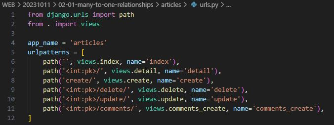

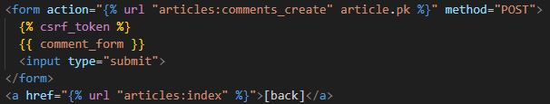

- url 작성 및 action 값 작성

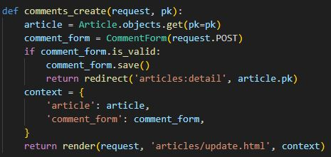

- comments_create view 함수 정의
- -> article 객체는 언제 저장할 수 있을까?

- save(commit=False)
- DB에 저장하지 않고 인스턴스만 반환
- (Create, but don't save the new instance.)

- save의 commit 인자를 활용해 외래 키 데이터 추가 입력

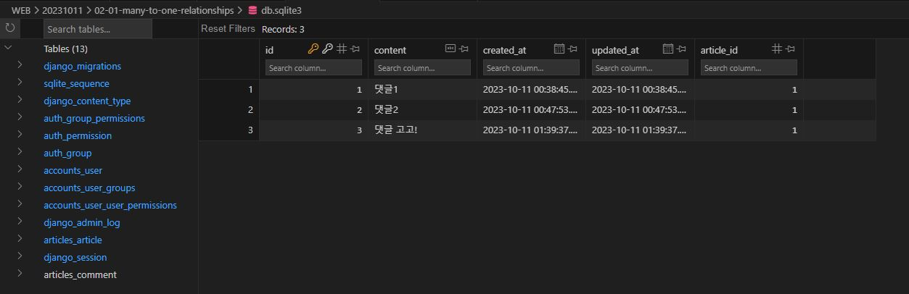

## 댓글 READ

### 댓글 READ 구현

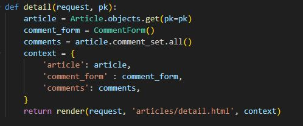

- detail view 함수에서 전체 댓글 데이터를 조회 (역참조)

- 전체 댓글 출력 및 확인

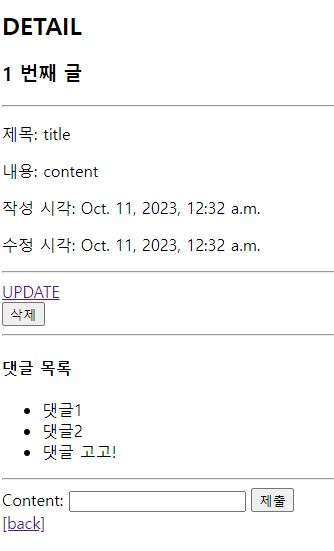

## 댓글 DELETE

### 댓글 DELETE 구현

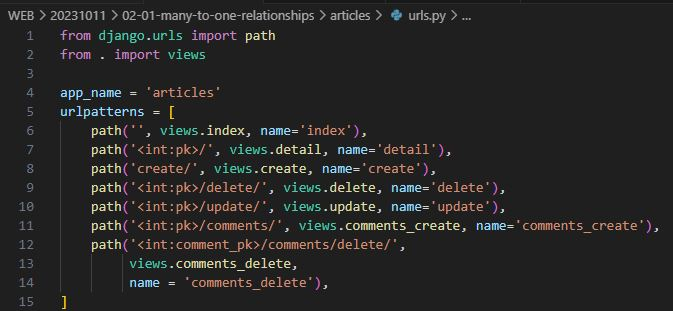

- 댓글 삭제 url 작성

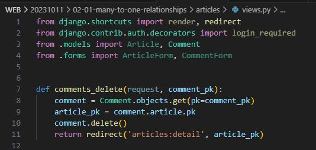

- 댓글 삭제 view 함수 정의

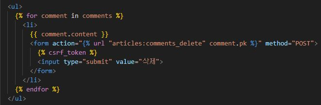

- 댓글 삭제 버튼 작성

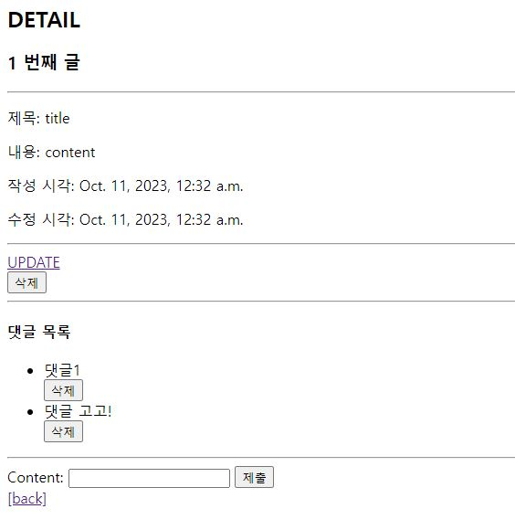

- 댓글 삭제 버튼 출력 확인 및 삭제 테스트

- article pk를 variable routing으로 받아서 사용해도 가능하다

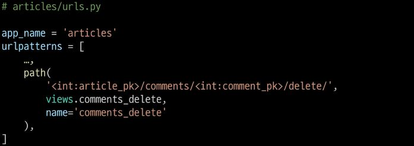

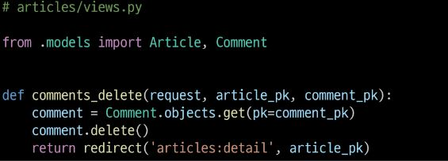

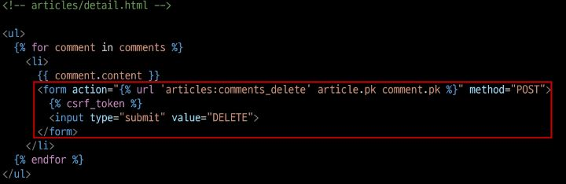