# Fundamenntals of Bootstrap

## Bootstrap
- CSS 프론트엔드 프레임워크 (Toolkit)
- 미리 만들어진 다양한 디자인 요소들을 제공하여 웹 사이트를 빠르고 쉽게 개발할 수 있도록 함
- The world most popular front-end open source

### Bootstrap 사용해보기
1. Bootstrap 공식 문서
2. Docs -> Introduction -> Quick start
3. 2번 "Include Bootstrap's CSS and JS" 코드 확인 및 가져오기
   (head와 body에 bootstrap CDN이 포함된 코드 블록)
   (link tag -> 부트 스트랩을 가져옴 / script -> JS)
   (link tag, script tag를 활용해서 온라인 상의 CSS, JS를 외부 참조 방식으로 가져옴)

```html
<!DOCTYPE html>
<html lang="en">

<head>
  <meta charset="UTF-8">
  <meta name="viewport" content="width=device-width, initial-scale=1.0">
  <title>Document</title>
  <link href="https://cdn.jsdelivr.net/npm/bootstrap@5.3.1/dist/css/bootstrap.min.css" rel="stylesheet" integrity="sha384-4bw+/aepP/YC94hEpVNVgiZdgIC5+VKNBQNGCHeKRQN+PtmoHDEXuppvnDJzQIu9" crossorigin="anonymous">
</head>

<body>
  <h1>Hello, world!</h1>
  <script src="https://cdn.jsdelivr.net/npm/bootstrap@5.3.1/dist/js/bootstrap.bundle.min.js" integrity="sha384-HwwvtgBNo3bZJJLYd8oVXjrBZt8cqVSpeBNS5n7C8IVInixGAoxmnlMuBnhbgrkm" crossorigin="anonymous"></script>
</body>

</html>
```
- bootstrap 적용 전


- bootstrap 적용 후


  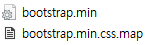
- 물리적인 bootstrap 파일이 존재 / 외부링크를 통해서 받아옴
- min = minified 압축 파일 -> 최소한의 로딩 줄이기 위함
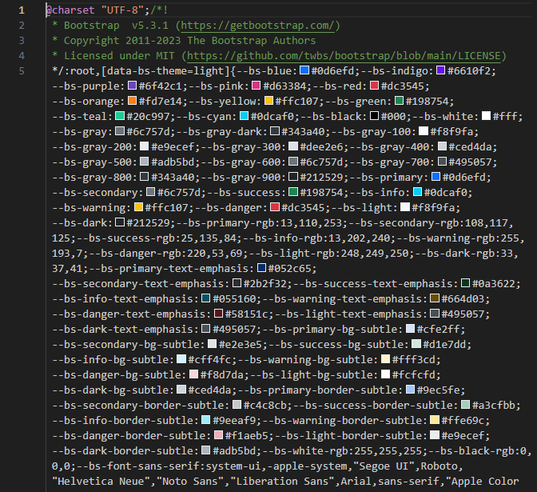


- 부트스트랩에서 이미 만들어진 클래스들을 가져다 쓴다 (가장 기본적인 방법)

- 크롬에서 만들었을 경우 cross browsing issue로 인해서 다른 브라우저에서 깨져 보일 수 있음
- 브라우저 마다 초기 스타일이 설정 되어 있어서 태그 별로 스타일이 적용되어 있음 (margin 등)
- 크롬<br>
 
- 파이어폭스 <br>

- 따라서 시작점을 맞춤 reset css / normalize css
- 부트스트랩에는 기본적으로 reset css 코드가 작성되어 있음

### Bootstrap 기본 사용법
- <p class="mt-5">Hello, world!</p>
- mt-5 (마진 탑 - 사이즈)
- {property}{sides}-{size} 픽셀은 아님

### Bootstrap에서 클래스 이름으로 Spacing 표현하는 방법
- Property : m (margin) / p (padding)
- Sides : t (top) / b (bottom) / s (left (start)) / e (right (end)) / y (top, bottom) / x (left, right) / blank(4 sides)
- Size : 0 (0 rem - 0 px) / 1 (0.25 rem - 4 px) / 2 (0.5 rem - 8 px) / 3 (1 rem - 16 px) / 4 (1.5 rem - 24 px) / 5 (3 rem - 48 px) / auto
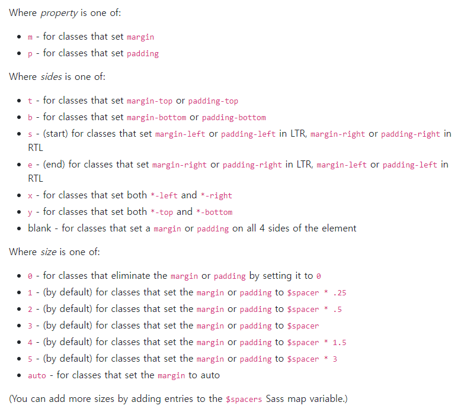

## Typography
- 제목, 본문 텍스트, 목록 등

### Display headings
- 기존 Heading 보다 더 눈에 띄는 제목이 필요할 경우 (더 크고 약간 다른 스타일)
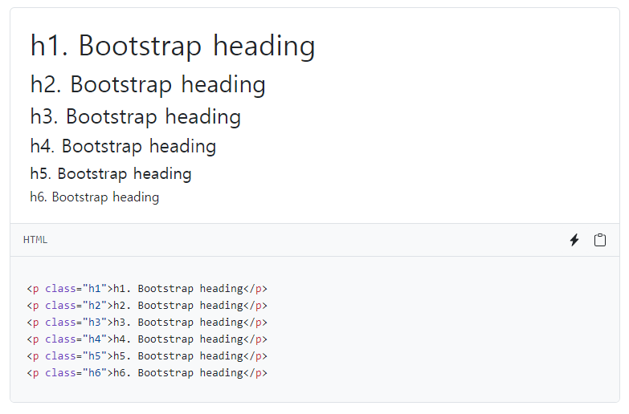


- 비율에 맞게 변화함

### Inline text elenments
- HTML inline 요소에 대한 스타일
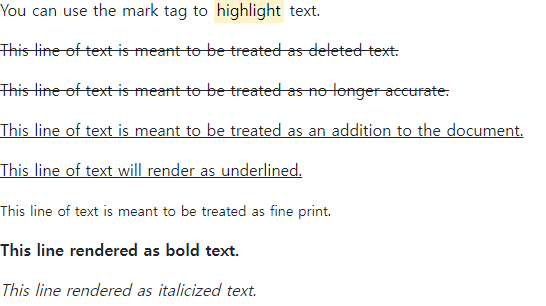

### Lists
- HTML list 요소에 대한 스타일
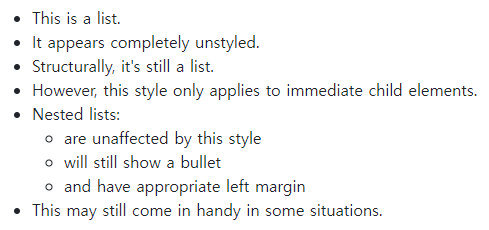

```html
<!DOCTYPE html>
<html lang="en">

<head>
  <meta charset="UTF-8">
  <meta name="viewport" content="width=device-width, initial-scale=1.0">
  <title>Document</title>
  <link href="https://cdn.jsdelivr.net/npm/bootstrap@5.3.1/dist/css/bootstrap.min.css" rel="stylesheet" integrity="sha384-4bw+/aepP/YC94hEpVNVgiZdgIC5+VKNBQNGCHeKRQN+PtmoHDEXuppvnDJzQIu9" crossorigin="anonymous">
</head>

<body>
  <h1 class="display-1">Display 1</h1>
  <h1 class="display-2">Display 2</h1>
  <h1 class="display-3">Display 3</h1>
  <h1 class="display-4">Display 4</h1>
  <h1 class="display-5">Display 5</h1>
  <h1 class="display-6">Display 6</h1>
  <p>You can use the mark tag to <mark>highlight</mark> text.</p>
  <p><del>This line of text is meant to be treated as deleted text.</del></p>
  <p><s>This line of text is meant to be treated as no longer accurate.</s></p>
  <p><ins>This line of text is meant to be treated as an addition to the document.</ins></p>
  <p><u>This line of text will render as underlined.</u></p>
  <p><small>This line of text is meant to be treated as fine print.</small></p>
  <p><strong>This line rendered as bold text.</strong></p>
  <p><em>This line rendered as italicized text.</em></p>
  <ul class="list">
    <li>This is a list.</li>
    <li>It appears completely unstyled.</li>
    <li>Structurally, it's still a list.</li>
    <li>However, this style only applies to immediate child elements.</li>
    <li>Nested lists:
      <ul>
        <li>are unaffected by this style</li>
        <li>will still show a bullet</li>
        <li>and have appropriate left margin</li>
      </ul>
    </li>
    <li>This may still come in handy in some situations.</li>
  </ul>
  <script src="https://cdn.jsdelivr.net/npm/bootstrap@5.3.1/dist/js/bootstrap.bundle.min.js" integrity="sha384-HwwvtgBNo3bZJJLYd8oVXjrBZt8cqVSpeBNS5n7C8IVInixGAoxmnlMuBnhbgrkm" crossorigin="anonymous"></script>
</body>

</html>

```

## Colors

### Bootstrap Color system
- Bootstrap이 지정하고 제공하는 색상 시스템
- Text, Border, Backgroud 및 다양한 요소에 사용하는 Bootstrap의 색상 키워드
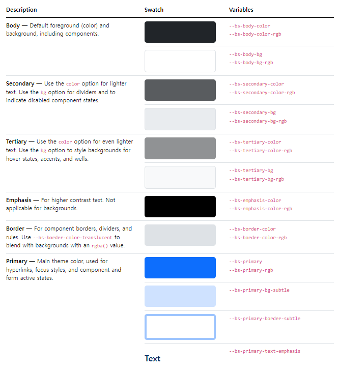

### Text colors
- Utilities - Colors
- 항상 클래스 적용 전에 link와 script를 통해 외부 적용을 먼저 해야한다


### Background colors


- div 태그 활용 / spacing

```html
<!DOCTYPE html>
<html lang="en">

<head>
  <meta charset="UTF-8">
  <meta name="viewport" content="width=device-width, initial-scale=1.0">
  <title>Document</title>
  <link href="https://cdn.jsdelivr.net/npm/bootstrap@5.3.1/dist/css/bootstrap.min.css" rel="stylesheet" integrity="sha384-4bw+/aepP/YC94hEpVNVgiZdgIC5+VKNBQNGCHeKRQN+PtmoHDEXuppvnDJzQIu9" crossorigin="anonymous">
</head>

<body>
  <p class="text-primary">.text-primary</p>
  <p class="text-primary-emphasis">.text-primary-emphasis</p>
  <p class="text-secondary">.text-secondary</p>
  <p class="text-secondary-emphasis">.text-secondary-emphasis</p>
  <p class="text-success">.text-success</p>
  <p class="text-success-emphasis">.text-success-emphasis</p>
  <p class="text-danger">.text-danger</p>
  <p class="text-danger-emphasis">.text-danger-emphasis</p>
  <p class="text-warning bg-dark">.text-warning</p>
  <p class="text-warning-emphasis">.text-warning-emphasis</p>
  <p class="text-info bg-dark">.text-info</p>
  <p class="text-info-emphasis">.text-info-emphasis</p>
  <p class="text-light bg-dark">.text-light</p>
  <p class="text-light-emphasis">.text-light-emphasis</p>
  <p class="text-dark bg-white">.text-dark</p>
  <p class="text-dark-emphasis">.text-dark-emphasis</p>

  <div class="p-3 mb-2 bg-primary text-white">.bg-primary</div>
  <div class="p-3 mb-2 bg-primary-subtle text-emphasis-primary">.bg-primary-subtle</div>
  <div class="p-3 mb-2 bg-secondary text-white">.bg-secondary</div>
  <div class="p-3 mb-2 bg-secondary-subtle text-emphasis-secondary">.bg-secondary-subtle</div>
  <div class="p-3 mb-2 bg-success text-white">.bg-success</div>
  <div class="p-3 mb-2 bg-success-subtle text-emphasis-success">.bg-success-subtle</div>
  <div class="p-3 mb-2 bg-danger text-white">.bg-danger</div>
  <div class="p-3 mb-2 bg-danger-subtle text-emphasis-danger">.bg-danger-subtle</div>
  <div class="p-3 mb-2 bg-warning text-dark">.bg-warning</div>
  <div class="p-3 mb-2 bg-warning-subtle text-emphasis-warning">.bg-warning-subtle</div>
  <div class="p-3 mb-2 bg-info text-dark">.bg-info</div>
  <div class="p-3 mb-2 bg-info-subtle text-emphasis-info">.bg-info-subtle</div>
  <div class="p-3 mb-2 bg-light text-dark">.bg-light</div>
  <div class="p-3 mb-2 bg-light-subtle text-emphasis-light">.bg-light-subtle</div>
  <div class="p-3 mb-2 bg-dark text-white">.bg-dark</div>
  <div class="p-3 mb-2 bg-dark-subtle text-emphasis-dark">.bg-dark-subtle</div>
  <p class="p-3 mb-2 bg-body-secondary">.bg-body-secondary</p>
  <p class="p-3 mb-2 bg-body-tertiary">.bg-body-tertiary</p>

  <script src="https://cdn.jsdelivr.net/npm/bootstrap@5.3.1/dist/js/bootstrap.bundle.min.js" integrity="sha384-HwwvtgBNo3bZJJLYd8oVXjrBZt8cqVSpeBNS5n7C8IVInixGAoxmnlMuBnhbgrkm" crossorigin="anonymous"></script>
</body>

</html>
```

### Bootstrap 실습
- 너비와 높이가 각각 200px인 정사각형 작성하기
  (너비와 높이를 제외한 스타일은 모두 bootstrap으로 작성)
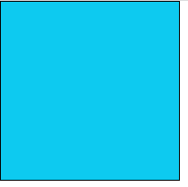
```html
<!DOCTYPE html>
<html lang="en">

<head>
  <meta charset="UTF-8">
  <meta http-equiv="X-UA-Compatible" content="IE=edge">
  <meta name="viewport" content="width=device-width, initial-scale=1.0">
  <title>Document</title>
  <link href="https://cdn.jsdelivr.net/npm/bootstrap@5.3.1/dist/css/bootstrap.min.css" rel="stylesheet"
    integrity="sha384-4bw+/aepP/YC94hEpVNVgiZdgIC5+VKNBQNGCHeKRQN+PtmoHDEXuppvnDJzQIu9" crossorigin="anonymous">
  <style>
    .box {
      width: 200px;
      height: 200px;
    }
  </style>
</head>

<body>
  <div class="box border border-black bg-info m-3"></div>

  <script src="https://cdn.jsdelivr.net/npm/bootstrap@5.3.1/dist/js/bootstrap.bundle.min.js"
    integrity="sha384-HwwvtgBNo3bZJJLYd8oVXjrBZt8cqVSpeBNS5n7C8IVInixGAoxmnlMuBnhbgrkm"
    crossorigin="anonymous"></script>
</body>

</html>
```
- bootstrap을 쓴다 해서 100% bootstrap만 쓰는 것은 아니다

## Bootstrap Component
- Bootstrap에서 제공하는 UI 관련 요소
  (버튼, 네비게이션 바, 카드, 폼, 드롭다운 등)

### 대표 Componenet 사용해보기
- Alerts
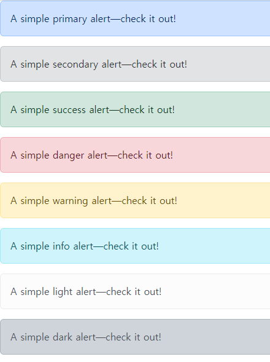
- Badges 
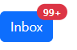
- Buttons
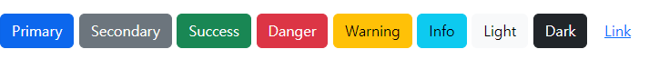
- Cards 
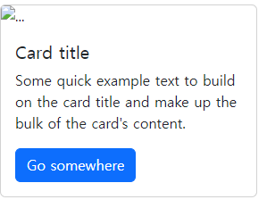
- Navbar
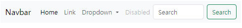
- Carousel


- Carousel 버튼이 이미지를 인식해야만 한다
- 버튼의 타겟 id를 설정해준다
```html
<!DOCTYPE html>
<html lang="en">

<head>
  <meta charset="UTF-8">
  <meta name="viewport" content="width=device-width, initial-scale=1.0">
  <title>Document</title>
</head>

<body>

</body>

</html>
<!DOCTYPE html>
<html lang="en">
<head>
  <meta charset="UTF-8">
  <meta name="viewport" content="width=device-width, initial-scale=1.0">
  <title>Document</title>
  <link href="https://cdn.jsdelivr.net/npm/bootstrap@5.3.1/dist/css/bootstrap.min.css" rel="stylesheet"
  integrity="sha384-4bw+/aepP/YC94hEpVNVgiZdgIC5+VKNBQNGCHeKRQN+PtmoHDEXuppvnDJzQIu9" crossorigin="anonymous">
</head>
<body>
  <!-- 1번 CARUOSEL -->
  <div id="carouselExample" class="carousel slide">
    <div class="carousel-inner">
      <div class="carousel-item active">
        
      </div>
      <div class="carousel-item">
        
      </div>
      <div class="carousel-item">
        
      </div>
    </div>
    <button class="carousel-control-prev" type="button" data-bs-target="#carouselExample" data-bs-slide="prev">
      <span class="carousel-control-prev-icon" aria-hidden="true"></span>
      <span class="visually-hidden">Previous</span>
    </button>
    <button class="carousel-control-next" type="button" data-bs-target="#carouselExample" data-bs-slide="next">
      <span class="carousel-control-next-icon" aria-hidden="true"></span>
      <span class="visually-hidden">Next</span>
    </button>
  </div>

  <!-- 2번 CAROUSEL -->
  <div id="carouselExample2" class="carousel slide">
    <div class="carousel-inner">
      <div class="carousel-item active">
        
      </div>
      <div class="carousel-item">
        
      </div>
      <div class="carousel-item">
        
      </div>
    </div>
    <button class="carousel-control-prev" type="button" data-bs-target="#carouselExample2" data-bs-slide="prev">
      <span class="carousel-control-prev-icon" aria-hidden="true"></span>
      <span class="visually-hidden">Previous</span>
    </button>
    <button class="carousel-control-next" type="button" data-bs-target="#carouselExample2" data-bs-slide="next">
      <span class="carousel-control-next-icon" aria-hidden="true"></span>
      <span class="visually-hidden">Next</span>
    </button>
  </div>
  <script src="https://cdn.jsdelivr.net/npm/bootstrap@5.3.1/dist/js/bootstrap.bundle.min.js"
  integrity="sha384-HwwvtgBNo3bZJJLYd8oVXjrBZt8cqVSpeBNS5n7C8IVInixGAoxmnlMuBnhbgrkm"
  crossorigin="anonymous"></script>
</body>
</html>
```

- Modal
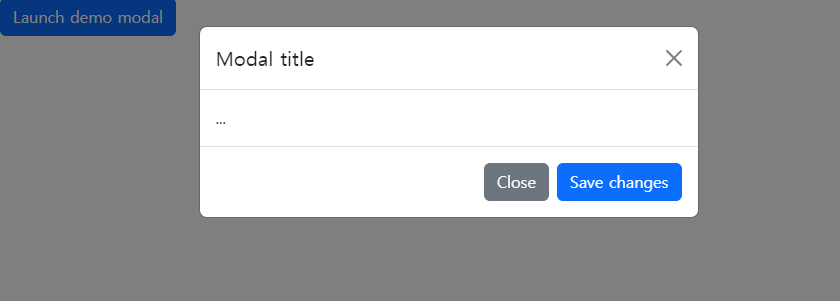
- 버튼과 modal을 개별로 갖고 있으며 target id를 설정해야 각자의 modal을 출력할 수 있다.
- 버튼과 modal의 코드가 별개 이기 때문에 같이 다닐 필요는 없다

```html
<!DOCTYPE html>
<html lang="en">

<head>
  <meta charset="UTF-8">
  <meta name="viewport" content="width=device-width, initial-scale=1.0">
  <title>Document</title>
  <link href="https://cdn.jsdelivr.net/npm/bootstrap@5.3.1/dist/css/bootstrap.min.css" rel="stylesheet"
  integrity="sha384-4bw+/aepP/YC94hEpVNVgiZdgIC5+VKNBQNGCHeKRQN+PtmoHDEXuppvnDJzQIu9" crossorigin="anonymous">
</head>

<body>
  <!-- Button trigger modal -->
  <button type="button" class="btn btn-primary" data-bs-toggle="modal" data-bs-target="#exampleModal">
    Launch demo modal
  </button>

  <!-- Modal -->
  <div class="modal fade" id="exampleModal" tabindex="-1" aria-labelledby="exampleModalLabel" aria-hidden="true">
    <div class="modal-dialog">
      <div class="modal-content">
        <div class="modal-header">
          <h1 class="modal-title fs-5" id="exampleModalLabel">Modal title</h1>
          <button type="button" class="btn-close" data-bs-dismiss="modal" aria-label="Close"></button>
        </div>
        <div class="modal-body">
          ...
        </div>
        <div class="modal-footer">
          <button type="button" class="btn btn-secondary" data-bs-dismiss="modal">Close</button>
          <button type="button" class="btn btn-primary">Save changes</button>
        </div>
      </div>
    </div>
  </div>
  <script src="https://cdn.jsdelivr.net/npm/bootstrap@5.3.1/dist/js/bootstrap.bundle.min.js"
  integrity="sha384-HwwvtgBNo3bZJJLYd8oVXjrBZt8cqVSpeBNS5n7C8IVInixGAoxmnlMuBnhbgrkm"
  crossorigin="anonymous"></script>
</body>

</html>
```
### Component의 이점
- 일관된 디자인을 제공하여 웹사이트의 구성 요소를 구축하는 데 유용하게 활용

## Semantic Web
- 웹 데이터를 의미론적으로 구조화된 형태로 표현하는 방식

### Semantic Web in HTML
- "문서의 최상위 제목"
- 단순히 최상위 제목 "처럼" 보이게 출력하는 것
- 페이지 최상위 제목 의미를 제공하는 semantic 요소 h1
- 브라우저의 의해 제목처럼 보이도록 스타일이 지정됨

### HTML Semantic Element
- 기본적인 모양과 기능 이외에 의미를 가지는 HTML 요소
- 검색엔진 및 개발자가 웹 페이지 콘텐츠를 이해하기 쉽도록

### semantic element
- header
- nav
- main
- article
- section
- aside
- footer
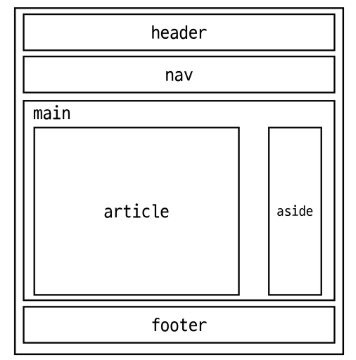

- semantic tag를 잘 활용하면 검색엔진 최적화를 할 수 있음

## Semantic in CSS

### OOCSS
- Object Oreinted CSS
- 객체 지향적 접근법을 적용하여 CSS를 구성하는 방법론

### CSS 방법론
- CSS를 효율적이고 유지 보수가 용이하게 작성하기 위한 일련의 가이드라인

### OOCSS 기본 원칙
1. 구조와 스킨을 분리
2. 컨테이너와 콘텐츠를 분리

### 구조와 스킨 분리
- 구조와 스킨을 분리함으로써 재사용 가능성을 높임
- 모든 버튼의 공통 구조를 정의 + 각각의 스킨(배경색과 폰트 색상)을 정의

### 컨테이너와 콘텐츠 분리
- 객체에 직접 적용하는 대신 객체를 둘러싸는 컨테이너에 스타일을 적용
- 스타일을 정의할 때 위치에 의존적인 스타일을 사용하지 않도록 함
- 콘텐츠를 다른 컨테이너로 이동시키거나 재배치할 때 스타일이 깨지는 것을 방지

### OOCSS 기본 원칙
- .header와 .footer 클래스가 폰트 크기와 색 둘 다 영향을 줌
- -> .container .title이 폰트 크기 담당 (콘텐츠 스타일)
- -> .header와 .footer가 폰트 색 담당(컨테이너 스타일)
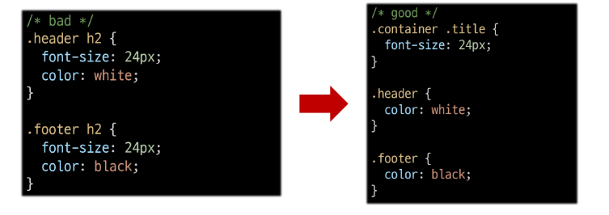