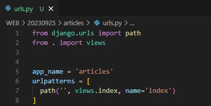
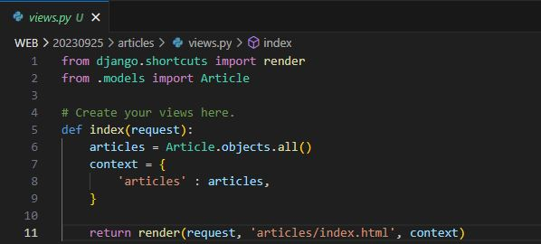
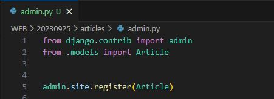
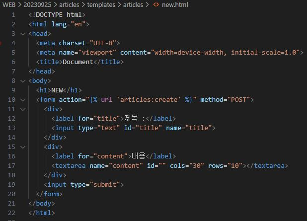
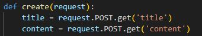
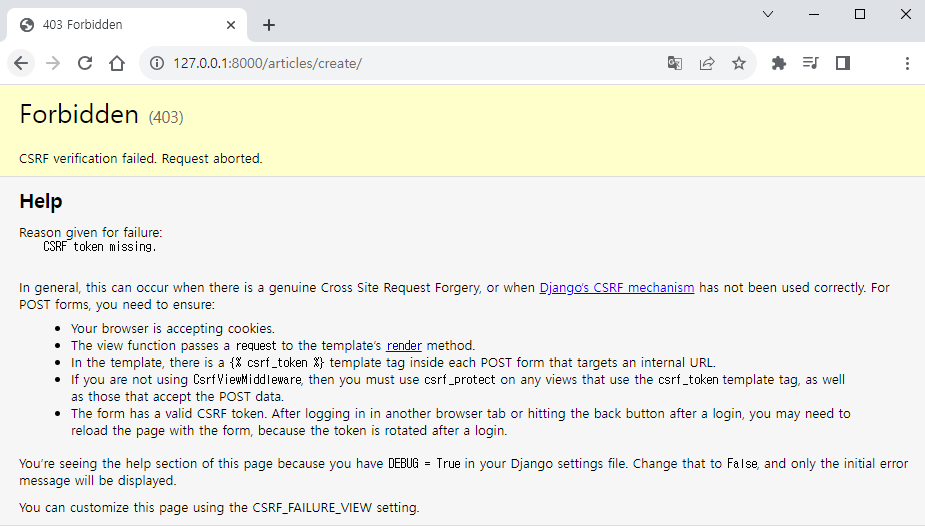
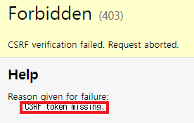
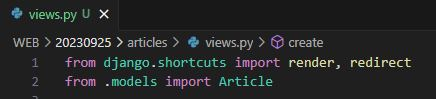
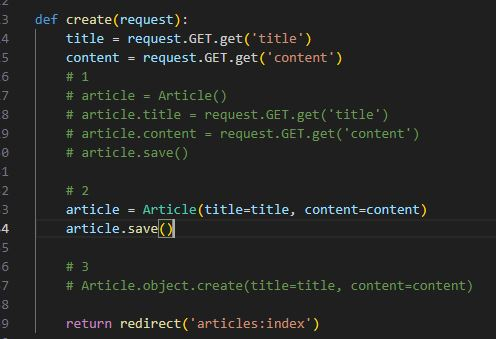

# Django ORM with view
- Djang shell에서 연습했던 QuerySet API를 직접 view 함수에서 사용하기

## Read
### 2가지 조회 진행
1. 전체 게시글 조회

- 프로젝트 URL 작성

- 앱 URL 작성

- QuerySet API를 view 함수에 작성하기
- (모델.objects.all())

- index.html 작성

- admin 페이지에 article 등록

- 전체 게시글 조회

2. 단일 게시글 조회

- 앱 URL 작성

- views 작성 (get을 사용할 때 장고에서 변함없는 값인 pk를 통해서 get을 하는 것을 추천)

- html 작성

- TIP) Error 에서 NoReverseMatch 에러는 URL 에러 이기 때문에 URL만 찾으면 된다

## Create
- Create 로직을 구현하기 위해 필요한 view 함수의 개수는?
1. 사용자 입력 데이터를 받을 페이지를 렌더링 (new)

- url 작성

- views 작성

- html 작성

- throw / catch를 위한 input name 등 자세히 작성

2. 사용자가 입력한 데이터를 받아 DB에 저장 (create)

- views 작성
  1. 첫번째 방법
   
   

  2. 두번째 방법

  

  3. 세번째 방법
   
  

- save 전에 유효성 검증 타이밍이 필요하기 때문에 두번째 방법을 선호

- html 작성

- new 작성

- create 작성

- 새 게시글

- create의 최종 목표는 save

## HTTP request methods

### HTTP
- 네트워크 상에서 데이터를 주고 받기위한 약속

### HTTP request methods
- 데이터(리소스)에 어떤 요청(행동)을 원하는지를 나타내는 것
- (GET & POST)

### 'GET' Method
- 특정 리소스를 '조회' 하는 요청
- (GET으로 데이터를 전달하면 Query string 형식으로 보내짐)
- https://127.0.0.1:8000/artilces/create/?title=제목&content=내용

- URL에 정보가 작성됨
- GET은 단순히 조회 목적이기 때문에 id password 등에서 사용해선 안됨

### 'POST' method
- 특정 리소스에 변경(생성, 수정, 삭제)을 요구하는 요청
- (POST로 데이터를 전달하면 HTTP Body에 담겨 보내짐)
- 데이터베이스 요청을 보내는 것은 큰 요청이기 때문에 GET요청으로 보내면 안된다

- 게시글 작성 후 403 응답 확인 (참고 404 : Not Found)
 
### HTTP response status code
- 특정 HTTP 요청이 성공적으로 완료되었는지를 3자리 숫자로 표현하기로 약속한 것

- https://developer.mozilla.org/en-US/docs/Web/HTTp/Status

### 403 Forbidden
- 서버에 요청이 전달되었지만, '권한' 때문에 거절되었다는 것을 의미

### 거절된 이유
- "CSRF token이 누락되었다"

### CSRF
- Cross-Site-Request-Forgery
- "사이트 간 요청 위조"
- -> 사용자가 자신의 의지와 무관하게 공격자가 의도한 행동을 하여 특정 웹 페이지를 보안에 취약하게 하거나 수정, 삭제 등의 작업을 하게 만드는 공격 방법

### CSRF Token 적용
- DTL의 csrf_token 태그를 사용해 사용자에게 토큰 값을 부여
- 요청시 토큰 값도 함께 서버로 전송될 수 있도록 함
- 토큰 없이 요청을 보냈을 경우 내가 만든 사이트에서 보낸 요청이 아니구나 라는 것을 판단해준다

- 난수값을 장고가 내가 발급한 난수값이 구나를 판단한다.

- GET 요청은 '조회'를 하는 요청이기 때문에 CSRF 토큰에 대해서 확인을 하지 않는다

### 요청 시 CSRF Token을 함께 보내야 하는 이유
- Django 서버는 해당 요청이 DB에 데이터를 하나 생성하는 (DB에 영향을 주는) 요청에 대해 "Django가 직접 제공한 페이지에서 데이터를 작성하고 있는 것 인지"에 대한 확인 수단이 필요한 것

- 겉모습이 똑같은 위조 사이트나 정상적이지 않은 요청에 대한 방어 수단
- 기존
- 요청 데이터 -> 게시글 작성
- 변경
- 요청 데이터 + 인증 토큰 -> 게시글 작성

### 그런데 왜 POST일 때만 Token을 확인할까?
- POST는 단순 조회를 위한 GET과 달리 특정 리소스에 변경 (생성, 수정, 삭제)을 요구하는 의미와 기술적인 부분을 가지고 있기 때문
- DB에 조작을 가하는 요청은 반드시 인증 수단이 필요
- -> 데이터베이스에 대한 변경사항을 만드는 요청이기 때문에 토큰을 사용해 최소한의 신원 확인을 하는 것

### 게시글 작성 결고
- 게시글 생성 후 개발자 도구를 사용해 Form Data가 전송되는 것 확인
- 더 이상 URL에 데이터가 표기되지 않음

## Redirect
- 다시요청하다
  
### 게시글 작성 후 완료를 알리는 페이지를 응답하는 것
- 게시글을 "조회해줘!" 라는 요청이 아닌 "작성해줘!" 라는 요청이기 때문에 게시글 저장 후 페이지를 응답하는 것은 POST 요청에 대한 적절한 응답이 아님

- 데이터 저장 후 페이지를 주는 것이 아닌 다른 페이지로 사용자로 보내야 한다.
- (사용자를 보낸다 == 사용자가 GET 요청을 한번 더 보내도록 해야한다.)

### redirect()
- 클라이언트가 인자에 작성된 주소로 다시 요청을 보내도록 하는 함수

- 글을 작성했을 때 메인페이지로 바로 돌아가는 것 처럼 보이지만 재요청을 통해서 index.html 로 다시 가는 것

### redirect 특징
- 해당 redirect에서 클라이언트는 detail url로 요청을 다시 보내게 됨
- 결과적으로 detail view 함수가 호출되어 detail view 함수의 반환 결과인 detail 페이지를 응답 반응
- 결국 사용자는 게시글 작성 후 작성된 게시글의 detail 페이지로 이동하는 것으로 느끼게 되는 것

## Delete

### Delete 기능 구현

1. url 작성
- 뭐를 삭제할 것인지 조회를 먼저 해야한다. (<int:pk>)

2. views 작성

- 삭제한 다음 다시 요청을 보내서 메인페이지로 돌아가는 것이 자연스럽다.

3. Detail 페이지 삭제 버튼 만들기
- delete 자체 페이지가 없다

## Update

### Update 로직을 구현하기 위해 필요한 view 함수의 개수는?
1. 사용자 입력 데이터를 받을 페이지를 렌더링(edit)

- 수정 시 이전 데이터가 출력 될 수 있도록 작성하기
- edit 페이지로 이동하기 위한 하이퍼링크 작성

2. 사용자가 입력한 데이터를 받아 DB에 저장 (update)

- 작성 후 게시글 수정 테스트

