# Django Template & URLs

## Template System

### Django Template system
- 데이터 표현을 제어하면서, 표현과 관련된 부분을 담당
  
### HTML의 콘텐츠를 변수 값에 따라 바꾸고 싶다면?

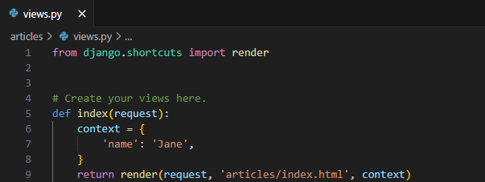

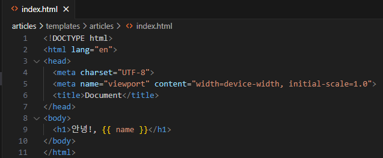

### Django Template Language (DTL)
- Template에서 조건, 반복, 변수 등의 프로그래밍적 기능을 제공하는 시스템

## DTL Syntax

### 1. Variable
- render 함수의 세번째 인자로 딕셔너리 데이터를 사용
- 딕셔너리 key에 해당하는 문자열이 template에서 사용 가능한 변수명이 됨
- dot(.)를 사용하여 변수 속성에 접근할 수 있음

```html
{{ varaible }}
```

### 2. Filters
- 표시할 변수를 수정할 때 사용
- chained가 가능하며 일부 필터는 인자를 받기도 함
- 약 60개의 built-in template filters를 제공
  
```html
{{ variable | filter}}
{{ name | truncatewords:30 }}
```

### 3. Tags
- 반복 또는 논리를 수행하여 제어 흐름을 만듦
- 일부 태그는 시작과 종료 태그가 필요
- 약 24개의 built-in template tags를 제공

```html

 
```

### 4. Comments
- DTL에서 주석
```html
한줄 주석
{# name #}

여러줄 주석

. . . . . .

```

### DTL 예시
1. urls 먼저 작성


2. views 함수 작성

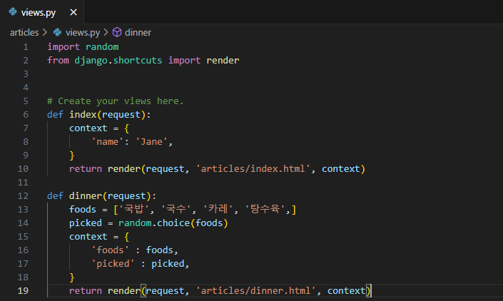

3. template에서 새로운 html 작성
- 랜덤으로 템플릿이 변경

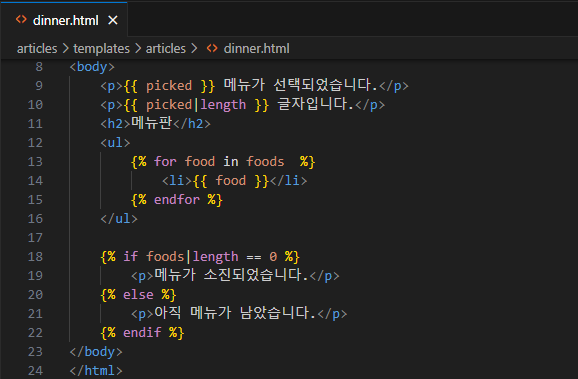

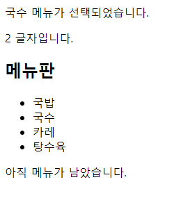

## 템플릿 상속

### 기본 템플릿 구조의 한계
- 만약 모든 템플릿에 bootstrap을 적용하려면?
- 모든 템플릿에 bootstrap CDN을 작성해야 할까?

### 템플릿 상속 (Template inheritnace)
- "페이지의 공통요소를 포함"하고, "하위 템플릿이 재정의 할 수 있는 공간"을 정의하는 기본 'skeleton' 템플릿을 작성하여 상속 구조를 구축

### 상속 구조 구축
- skeleton 역할의 상위 템플릿 작성

1. base template 작성 (부트스트랩 작성)
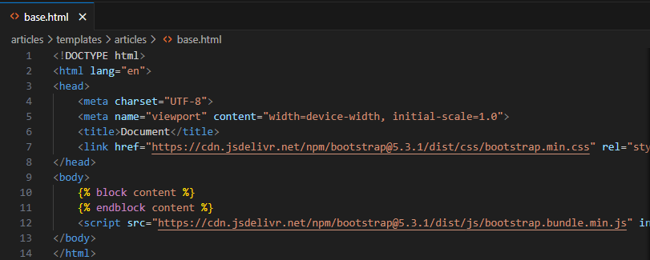

2. 상속 받기


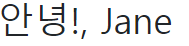


### 'extends' tag
```html

```
- 자식(하위)템플릿이 부모 템플릿을 확장한다는 것을 알림
- "반드시 템플릿 최상단에 작성되어야 함 (2개 이상 사용 불가)"

### 'block' tag
```html

```
- 하위 템플릿에서 재정의 할 수 있는 블록을 정의
- (하위 템플릿이 작성할 수 있는 공간을 지정)

## HTML form (요청과 응답)

### 데이터를 보내고 가져오기 (Sending and Retrieving form data)
- HTML form element를 통해 사용자와 애플리케이션 간의 상호작용 이해하기

### HTML form은 HTTP 요청을 서버에 보내는 가장 편리한 방법


### 'form' element
- 사용자로부터 할당된 데이터를 서버로 전송
- -> 웹에서 사용자 정보를 입력하는 여러 방식 (text, password, checkbox 등)을 제공
- 
### fake Naver 실습


- GET 방식의 특징은 url에 키 밸류 값으로 노출 시켜서 보내게 된다
- 단 아이디 비밀번호에 GET 방식을 사용하면 그대로 url에 노출 되기 때문에 다른 방식을 사용하게 된다
  


### 'action' & 'method'
- form의 핵심 속성 2가지
- "데이터를 어디(action)로 어떤 방식(method)으로 요청할지"

### action과 method
1. action
- 입력 데이터가 전송될 URL을 지정(목적지)
- 만약 이 속성을 지정하지 않으면 데이터는 현재 form이 있는 페이지의 URL로 보내짐

2. method
- 데이터를 어떤 방식으로 보낼 것인지 정의
- 데이터 HTTP request methods(GET, POST)를 지정

### 'input' element
- 사용자의 데이터를 입력 받을 수 있는 요소
- (type 속성 값에 따라 다양한 유형의 입력 데이터를 받음)

### 'name' attribute
- input의 핵심 속성
- 입력한 데이터에 붙이는 이름(key)
- -> 데이터를 제출했을 때 서버는 name 속성에 설정된 값을 통해서 사용자가 입력한 데이터에 접근할 수 있음

### Query String Parameters
- 사용자의 입력 데이터를 URL 주소에 파라미터를 통해 서버로 보내는 방법
- 문자열은 앰퍼샌드(&)로 연결된 key=value 쌍으로 구성되며, 기본 URL과 물음표(?)로 구분됨

## form 활용

### 사용자 입력 데이터를 받아 그대로 출력하는 서버 만들기

### Throw & Catch


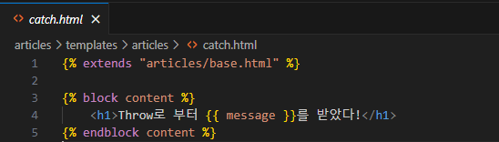


### HTTP request 객체
- form으로 전송한 데이터 뿐만 아니라 모든 요청 관련 데이터가 담겨 있음
  (view 함수의 첫번째 인자)
  


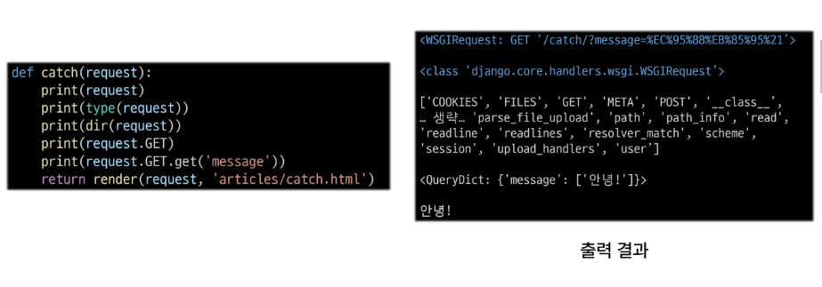
- QueryDict -> 딕셔너리 형태 


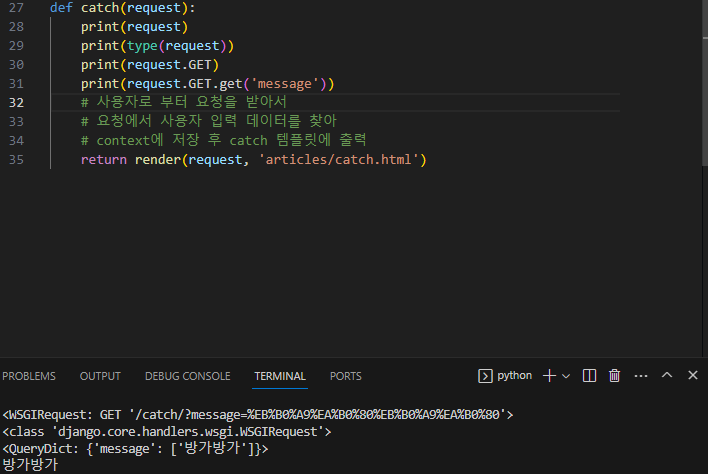

## Django URLs

### 요청과 응답에서 Django URLs의 역할
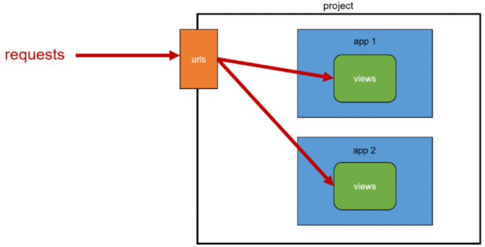

### URL dispatcher
- (운항 관리자, 분배기)
- URL 패턴을 정의하고 해당 패턴이 일치하느 요청을 처리할 view 함수를 연결 (매핑)

## 변수와 URL

### 현재 URL 관리의 문제점
- 템플릿의 많은 부분이 중복되고, URL의 일부만 변경되는 상황이라만 계속해서 비슷한 URL과 템플릿을 작성해 나가야 할까?


### Variable Routing
- URL 일부에서 변수를 포함시키는 것
 (변수는 view 함수의 인자로 전달 할 수 있음)


- urls 에서 넘어온 name 변수


### Variable routing 작성법


### Path converters
- URL 변수의 타입을 지정 (str, int 등 5가지 타입 지원)

